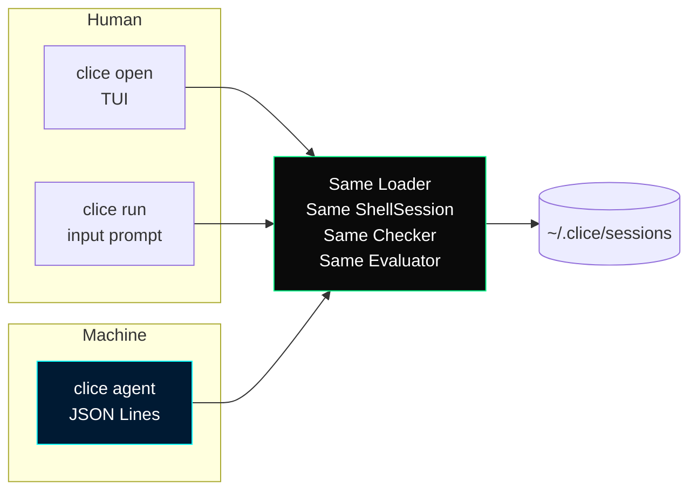
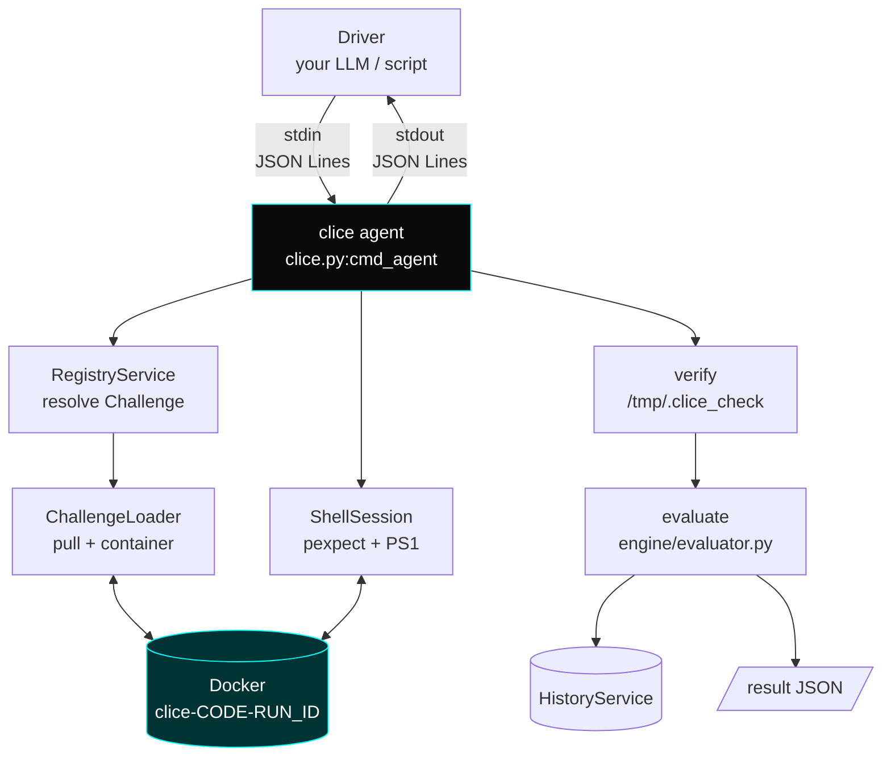
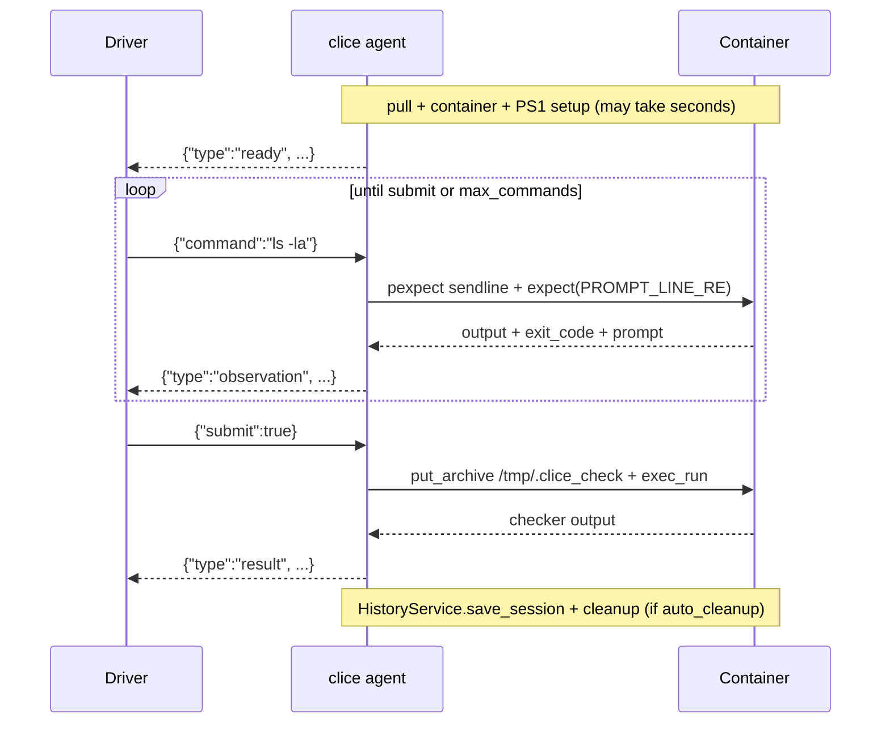
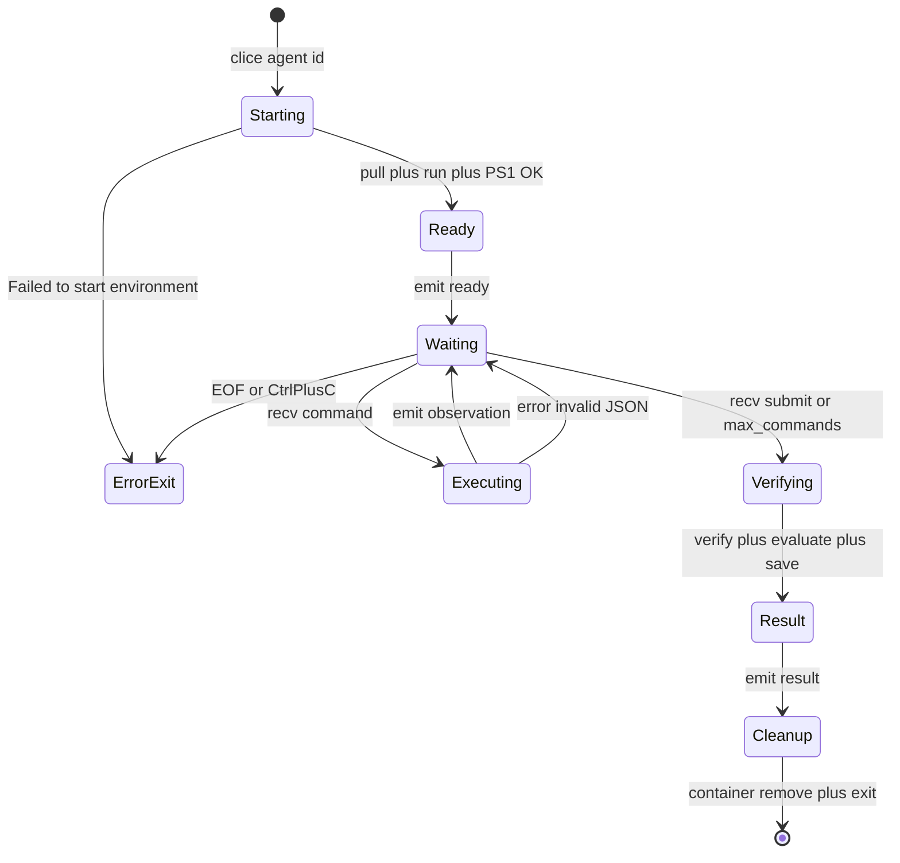
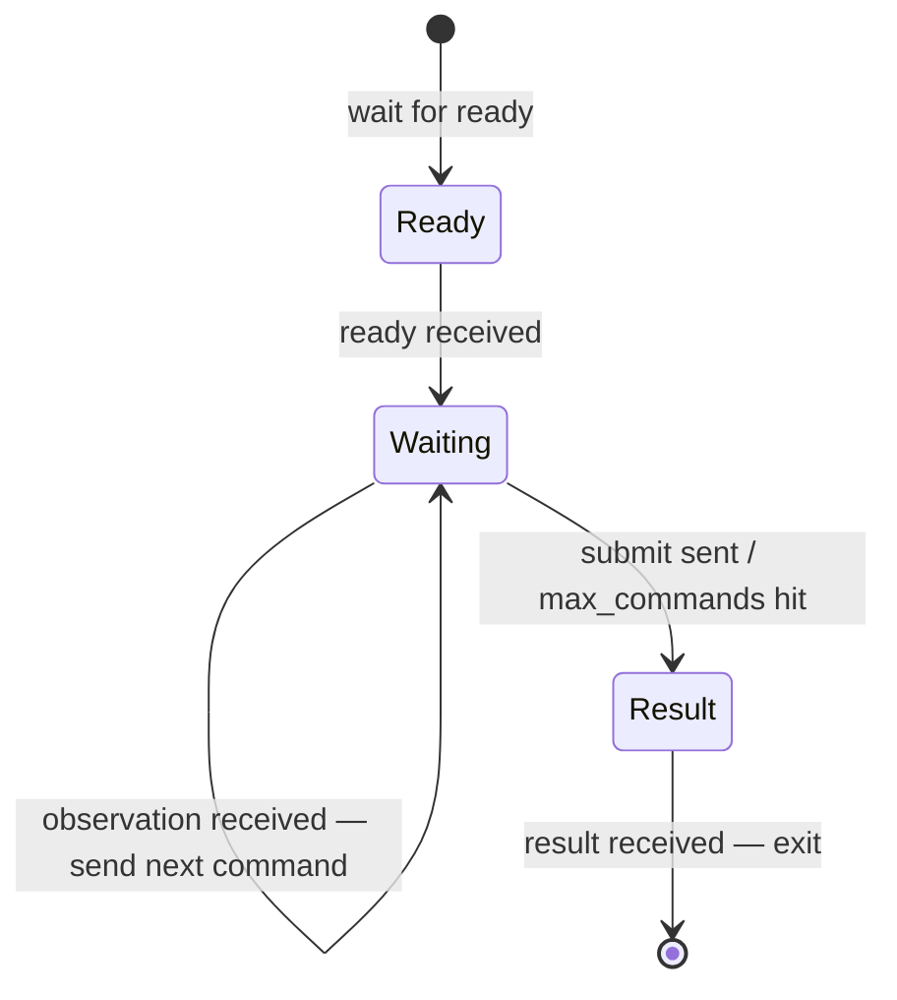

# **Clice Agent Mode Guide**

> **Scope:** This is the _machine-facing_ twin of `clice run`. Same containers, same checker, same scoring — only the UI is different. If `run` is for humans, `agent` is for LLMs, scripts, and evaluation harnesses.
>
> Companion docs: [CLI Reference](./Clice-CLI-Reference.md) · [User Manual](./Clice-User-Manual.md) · [Technical Documentation](./Clice-Technical-Documentation.md)

---

### Table of Contents

1. [What Agent Mode Is — and Isn't](#1-what-agent-mode-is--and-isnt)
2. [Architecture](#2-architecture)
3. [Invocation](#3-invocation)
4. [Protocol — JSON Lines](#4-protocol--json-lines)
   - [4.1 Message Flow](#41-message-flow)
   - [4.2 `ready`](#42-ready)
   - [4.3 `observation`](#43-observation)
   - [4.4 `error`](#44-error)
   - [4.5 `result`](#45-result)
5. [Lifecycle & State Machine](#5-lifecycle--state-machine)
6. [Driver Examples](#6-driver-examples)
   - [6.1 Minimal — Bash heredoc](#61-minimal--bash-heredoc)
   - [6.2 Python — Subprocess + json](#62-python--subprocess--json)
   - [6.3 Python — Async + timeout](#63-python--async--timeout)
   - [6.4 Node — spawn + readline](#64-node--spawn--readline)
7. [Limits & Safety](#7-limits--safety)
8. [Metrics, History & Logs](#8-metrics-history--logs)
9. [Comparison Table — `open` vs `run` vs `agent`](#9-comparison-table--open-vs-run-vs-agent)
10. [Common Recipes](#10-common-recipes)
11. [Troubleshooting](#11-troubleshooting)
12. [Reference — One-Page Cheat Sheet](#12-reference--one-page-cheat-sheet)

---

### 1. What Agent Mode Is — and Isn't

**Is:**

- A **JSON Lines** (`\n`-delimited JSON) REPL over `stdin`/`stdout`. You send `{ "command": "ls" }`, you get `{ "type": "observation", "stdout": "...", "exit_code": 0 }`. You send `{ "submit": true }`, you get `{ "type": "result", "passed": true, ... }`.
- **Identical grading** to a human session. The exact same `ChallengeLoader`, `ShellSession` (`pexpect` + `docker exec`), `verify()` (`put_archive` + `exec_run`), and `engine/evaluator.py:evaluate()` pipeline. An LLM is never graded more leniently — or more harshly — than a person.
- **History-native.** Every agent run writes `~/.clice/sessions/<uuid>.json` and is visible in `clice history` / the TUI History screen.

**Isn't:**

- Not a TUI. No `Home`/`Browser`/`VerdictScreen`. If you need a human to watch, use `clice open` or `clice run`.
- Not a sandbox escape. Commands still execute via `docker exec` inside the _same_ per-challenge container (`clice-{code}-{run_id}`).
- Not streaming stdout while a command runs. You get the _complete_ output only after the prompt returns (or after 30s `pexpect` timeout).



---

### 2. Architecture



Key implementation detail (`clice.py:cmd_agent`): `ChallengeLoader` / `ShellSession` human-facing `print()` calls are wrapped in `_quiet_stdout()` — `sys.stdout` is temporarily redirected to `sys.stderr`. **Stdout is _only_ your JSON protocol.** If you capture stderr separately, you'll still see the familiar `Pulling …`, `Downloading …`, `✓` lines for debugging without breaking the JSON stream.

---

### 3. Invocation

```bash
clice agent <challenge> [--max-commands N]
```

| Arg / Flag         | Required | Default | Description                                                                                                                        |
| :----------------- | :------- | :------ | :--------------------------------------------------------------------------------------------------------------------------------- |
| `<challenge>`      | yes      | —       | Challenge `<id>` — short `code`, full UUID, or `≥8`-char prefix (same resolver as `open`/`run`, see CLI Reference §3).             |
| `--max-commands N` | no       | `100`   | Force-submit after `N` commands. Counted server-side; on exceed, emits `error` then auto-submits (doesn't wait for your `submit`). |

**Examples:**

```bash
clice agent hello-clice
clice agent hello-clice --max-commands 50
clice agent 550e8400                    # 8-char prefix
clice agent 550e8400-e29b-41d4-a716-446655440000  # full UUID
```

**Exit codes** (same as `run`):

| Code  | Meaning                                                                           |
| :---- | :-------------------------------------------------------------------------------- |
| `0`   | `passed == true` (checker `exit_code == 0`)                                       |
| `1`   | `passed == false` (checker fail _or_ `ENVIRONMENT ERROR` _or_ unknown challenge)  |
| `130` | Interrupted before submit (`Ctrl+C`/EOF on stdin) — prints `error` then `cleanup` |

---

### 4. Protocol — JSON Lines

One JSON object per line, **UTF-8**, **no trailing commas**. After every line you write, flush (`\n` + `flush=True`). After every line clice writes, read exactly one line and `json.loads` it.

#### 4.1 Message Flow



Rules:

- Send **either** `{"command": "<string>"}` **or** `{"submit": true}` per line — not both.
- Unknown shape (`{"cmd": …}`) → `error` response, then waits for next line.
- Invalid JSON → `error` with `Invalid JSON: …`, then waits.
- Empty/whitespace-only stdin lines are **ignored** (no response).
- `command` may be any non-empty string — including `|` pipelines, `;` chains, `$()` substitution. It is sent literally to bash.
- Blocked commands (`nano|vim|vi|crontab|top|htop|less|more`) do not exec; you get an `observation` with `stdout: "[BLOCKED] … not allowed"`, `exit_code: 1` immediately.

#### 4.2 `ready`

First line clice emits, **once**, after the container is running and the first `[CLICE]` prompt has been captured. **Do not send commands before you see this.**

```json
{
  "type": "ready",
  "prompt": "root@a1b2c3:/workspace$",
  "challenge": {
    "code": "hello-clice",
    "title": "Hello Clice",
    "description": "Create /workspace/hello.txt containing \"hello clice\"",
    "objectives": [
      "Create /workspace/hello.txt",
      "File must contain hello clice"
    ]
  }
}
```

| Field       | Type      | Notes                                                                                                                                                                 |
| :---------- | :-------- | :-------------------------------------------------------------------------------------------------------------------------------------------------------------------- |
| `type`      | `"ready"` |                                                                                                                                                                       |
| `prompt`    | `string`  | Decoded from `child.match.group(1)` after `PS1` setup — e.g. `root@a1b2c3:/workspace$`. Empty string only on fatal capture bug.                                       |
| `challenge` | `object`  | Subset of registry entry: `code`, `title`, `description`, `objectives[]`. Not the full `registry.json` — no `image`/`check_url`/`markdown` (redundant for the agent). |

> **Timeout note:** If pull/start fails, clice never emits `ready`. Instead it emits a single `{"type":"error","message":"Failed to start environment: …"}` and exits `1`. Your driver must handle the _absence_ of `ready`.

#### 4.3 `observation`

One per successful `command`. Output has already been through `logger/session.py` hygiene: ANSI stripped, `PROMPT_LEAK_RE` removed, echo (`<command>`) stripped from the head, `lstrip("\r\n")`.

```json
{
  "type": "observation",
  "stdout": "hello clice\n",
  "exit_code": 0,
  "elapsed": 0.042,
  "prompt": "root@a1b2c3:/workspace$"
}
```

| Field       | Type            | Notes                                                                                                              |
| :---------- | :-------------- | :----------------------------------------------------------------------------------------------------------------- |
| `type`      | `"observation"` |                                                                                                                    |
| `stdout`    | `string`        | Cleaned combined stdout. May be `""` (e.g., `mkdir` with no output). Never includes the prompt or your input line. |
| `exit_code` | `int`           | From secondary `echo $?` transaction. `-1` only on `pexpect.TIMEOUT` (>30s).                                       |
| `elapsed`   | `float`         | `time.time() - start` for this command, rounded 3 decimals.                                                        |
| `prompt`    | `string`        | Updated after _this_ command (tracks `cd`, `PS1` changes). Use this as your next prompt hint.                      |

Special cases:

- **Blocked:** `{"type":"observation","stdout":"[BLOCKED] nano not allowed","exit_code":1,"elapsed":0.0,"prompt":""}` — `prompt` is empty string (no shell transaction).
- **Timeout:** `{"type":"observation","stdout":"[TIMEOUT] Command exceeded 30 seconds","exit_code":-1,"elapsed":30.0,"prompt":""}` — pexpect hit its 30s guard; `_clear_and_reset()` attempted.

#### 4.4 `error`

Non-fatal protocol errors (fatal startup errors also use this `type` but then exit):

```json
{"type": "error", "message": "Invalid JSON: Expecting value: line 1 column 1 (char 0)"}
{"type": "error", "message": "Expected a 'command' or 'submit' key"}
{"type": "error", "message": "max_commands (100) exceeded - submitting current state"}
{"type": "error", "message": "Interrupted before submit"}
```

After `max_commands` exceed, clice **breaks the stdin loop and falls through to `submit()`** — you'll get a `result` next, even though you never sent `submit`. After any other `error`, clice **continues** waiting for the next input line.

#### 4.5 `result`

Final line, **once**. After this, clice `cleanup()` and exits. It also double-writes to `HistoryService` (so `clice history` agrees).

```json
{
  "type": "result",
  "passed": true,
  "checker_exit_code": 0,
  "checker_output": "All checks passed.",
  "checker_error": null,
  "metrics": {
    "correctness": 1.0,
    "command_count": 3,
    "time_seconds": 12.4,
    "error_rate": 0.0,
    "goal_reached": true
  },
  "log_path": "/home/you/.clice/sessions/4f8a9c2e-...json"
}
```

| Field               | Type           | Notes                                                                                                                                                                  |
| :------------------ | :------------- | :--------------------------------------------------------------------------------------------------------------------------------------------------------------------- |
| `passed`            | `bool`         | `checker_exit_code == 0 && checker_error === null`                                                                                                                     |
| `checker_exit_code` | `int\|null`    | `null` on timeout/staging failure (no exec)                                                                                                                            |
| `checker_output`    | `string`       | Combined stdout+stderr from `/tmp/.clice_check` (`.strip()`), up to whatever the checker prints (usually short).                                                       |
| `checker_error`     | `string\|null` | Human staging/timeout message (`No checker script cached …`, `Checker timed out after 20s`, `Couldn't stage checker: …`) → maps to `ENVIRONMENT ERROR` in TUI.         |
| `metrics`           | `object`       | Same as `engine/evaluator.py:evaluate(log)` — `correctness` (0/1), `command_count`, `time_seconds` (max(0, diff)), `error_rate` (0–100), `goal_reached` (== `passed`). |
| `log_path`          | `string`       | Absolute `~/.clice/sessions/<uuid>.json` that `HistoryService.save_session()` wrote. Path remains even after container removal.                                        |

TUI verdict mapping (same semantics, but `agent` surfaces raw fields):

| `passed` / `checker_error`    | TUI badge                 | Text                      |
| :---------------------------- | :------------------------ | :------------------------ |
| `passed:true, error:null`     | PASS (green)              | `Challenge: ✓ PASSED`     |
| `passed:false, error:null`    | FAIL (red)                | `Challenge: ✗ FAILED`     |
| `error:"Checker timed out …"` | ENVIRONMENT ERROR (amber) | `⚠ ENVIRONMENT ERROR - …` |

---

### 5. Lifecycle & State Machine



- **Starting** may be the longest phase (image pull → `docker_timeout` 30s). Your driver should set a **read timeout ≥90s** for `ready` on first runs. Subsequent runs (cached image) are <3s.
- **Executing** has a **30s hard pexpect timeout** per command. A `sleep 60` will return an `observation` with `[TIMEOUT]` after 30s and still count as one command.
- **Waiting** ignores blank stdin lines (no response).
- **Verifying** is capped by `resources.checker_timeout` (default 20s). If hit, `checker_error` is set.

---

### 6. Driver Examples

#### 6.1 Minimal — Bash heredoc

```bash
clice agent hello-clice <<'JSON' | python3 -m json.tool
{"command": "echo 'hello clice' > hello.txt"}
{"command": "cat hello.txt"}
{"submit": true}
JSON
```

Output (pretty-printed per line):

```json
{"type": "ready", "prompt": "root@e3b0:/workspace$", ...}
{"type": "observation", "stdout": "", "exit_code": 0, ...}
{"type": "observation", "stdout": "hello clice\n", "exit_code": 0, ...}
{"type": "result", "passed": true, ...}
```

> Each `| python3 -m json.tool` highlights one line at a time; in a `while read -r` loop you'd `json.loads` per line.

#### 6.2 Python — Subprocess + json ⭐ recommended starter

```python
#!/usr/bin/env python3
import json, subprocess, sys

CHALLENGE = "hello-clice"

proc = subprocess.Popen(
    ["clice", "agent", CHALLENGE, "--max-commands", "50"],
    stdin=subprocess.PIPE, stdout=subprocess.PIPE, stderr=sys.stderr,
    text=True, bufsize=1,
)

def send(obj):
    line = json.dumps(obj)
    proc.stdin.write(line + "\n")
    proc.stdin.flush()

def recv():
    line = proc.stdout.readline()
    if not line:
        raise EOFError("clice exited before result")
    return json.loads(line)

# 1. wait for ready (may block on pull — don't set a tiny timeout)
msg = recv()
assert msg["type"] == "ready", msg
print("Ready prompt:", msg["prompt"], file=sys.stderr)
print("Challenge:", msg["challenge"]["title"], file=sys.stderr)

# 2. drive commands (this is where your LLM would decide each command)
for cmd in [
    "echo 'hello clice' > hello.txt",
    "cat hello.txt",
]:
    send({"command": cmd})
    obs = recv()
    assert obs["type"] == "observation"
    print(f"$ {cmd}\n{obs['stdout']}(exit {obs['exit_code']}, {obs['elapsed']}s)", file=sys.stderr)

# 3. submit
send({"submit": True})
result = recv()
assert result["type"] == "result"
print(json.dumps(result, indent=2))
proc.stdin.close()
sys.exit(0 if result["passed"] else 1)
```

Run:

```bash
python3 driver.py
echo "driver exit: $?"     # 0 = PASS, 1 = FAIL
```

**LLM loop variant** — replace the `for` with:

```python
history = []
for _ in range(20):
    # prompt LLM with history + last observation
    next_cmd = llm.choose(history)  # returns "ls", "cat ...", or "__SUBMIT__"
    if next_cmd == "__SUBMIT__":
        break
    send({"command": next_cmd})
    obs = recv()
    history.append((next_cmd, obs))
    if obs["type"] == "error":
        break
send({"submit": True})
result = recv()
```

#### 6.3 Python — Async + timeout

Use `asyncio` if you run many agents in parallel or want per-command timeouts shorter than pexpect's 30s.

```python
import asyncio, json, sys

async def agent_session(challenge="hello-clice", cmds=None, timeout=90):
    proc = await asyncio.create_subprocess_exec(
        "clice", "agent", challenge,
        stdin=asyncio.subprocess.PIPE,
        stdout=asyncio.subprocess.PIPE,
        stderr=sys.stderr
    )
    async def recv():
        line = await asyncio.wait_for(proc.stdout.readline(), timeout=timeout)
        return json.loads(line) if line else None
    async def send(obj):
        proc.stdin.write((json.dumps(obj)+"\n").encode())
        await proc.stdin.drain()

    ready = await recv()  # may take up to 90s on first pull
    print("ready:", ready["prompt"])
    for cmd in (cmds or []):
        await send({"command": cmd})
        obs = await recv()
        print(obs)
    await send({"submit": True})
    result = await recv()
    print("PASS" if result["passed"] else "FAIL", result["metrics"])
    proc.stdin.close()
    await proc.wait()

asyncio.run(agent_session(cmds=["echo hello clice > hello.txt"]))
```

#### 6.4 Node — spawn + readline

```js
// driver.mjs
import { spawn } from "node:child_process";
import { createInterface } from "node:readline";

const proc = spawn("clice", ["agent", "hello-clice"], {
  stdio: ["pipe", "pipe", "inherit"],
});
const rl = createInterface({ input: proc.stdout });

const send = (o) => proc.stdin.write(JSON.stringify(o) + "\n");

let stage = "ready";
rl.on("line", (line) => {
  const msg = JSON.parse(line);
  console.log(
    "<",
    msg.type,
    msg.type === "observation" ? msg.stdout.slice(0, 60) : "",
  );
  if (msg.type === "ready") {
    send({ command: "echo 'hello clice' > hello.txt" });
  } else if (msg.type === "observation" && stage === "ready") {
    stage = "done";
    send({ command: "cat hello.txt" });
  } else if (msg.type === "observation") {
    send({ submit: true });
  } else if (msg.type === "result") {
    console.log(msg.passed ? "PASS" : "FAIL", msg.metrics);
    rl.close();
    proc.stdin.end();
    process.exit(msg.passed ? 0 : 1);
  }
});
```

---

### 7. Limits & Safety

| Guard                | Where                                                                                        | Default                             | What happens                                                                                                                                                                                                                                                       |
| :------------------- | :------------------------------------------------------------------------------------------- | :---------------------------------- | :----------------------------------------------------------------------------------------------------------------------------------------------------------------------------------------------------------------------------------------------------------------- |
| **`--max-commands`** | `cmd_agent` stdin loop                                                                       | `100`                               | After N `command` messages, emits `error` + auto-submits (no `submit` needed). Prevents infinite loops from buggy LLMs. Count is _per-session_, not per-challenge image.                                                                                           |
| **pexpect timeout**  | `ShellSession.execute(): expect(PROMPT_LINE_RE, timeout=30)`                                 | `30s`                               | Returns `observation` with `stdout:"[TIMEOUT] …"` and `exit_code:-1`. The shell is then `_clear_and_reset()` (send blank line, re-expect).                                                                                                                         |
| **checker timeout**  | `ChallengeLoader.verify(): join(timeout=checker_timeout)`                                    | `20s` (`resources.checker_timeout`) | Returns `checker_error: "Checker timed out after 20s"`, `passed:false`, `checker_exit_code:null`. Configurable via `clice set resources.checker_timeout 5` — but note `hello-clice` checker is ~40ms, so `1` still won't timeout; use a slower challenge for demo. |
| **pull timeout**     | `ChallengeLoader._pull_with_timeout(): join(timeout=docker_timeout)`                         | `30s` (`resources.docker_timeout`)  | Raises `TimeoutError` before `ready` — driver sees `error` + exit `1` (no container).                                                                                                                                                                              |
| **blocked commands** | `ShellSession.execute`: `blocked = ['nano','vim','vi','crontab','top','htop','less','more']` | —                                   | Immediate `observation` with `[BLOCKED] … not allowed`, `exit_code:1`. Extend the list in `logger/session.py` if your harness needs more.                                                                                                                          |
| **TUI-stale config** | `Config`                                                                                     | —                                   | `agent` spawns a fresh `Config()` each run, so `clice set` applies immediately (unlike a long-lived TUI process). No restart needed.                                                                                                                               |

**Resource caps** (same as human sessions — inherited from `Config` → `ChallengeLoader.containers.run`):

- `resources.memory` → `mem_limit` (e.g., `512m`)
- `resources.cpu_cores` → `nano_cpus`
- `behaviour.network` → `network_disabled`
- `behaviour.auto_cleanup` → whether `cleanup()` deletes the container after `result`. When `off`, the container persists — inspect with `docker exec -it clice-<code>-<run_id> bash`; then `docker rm -f …` or `clice gc`.

---

### 8. Metrics, History & Logs

Every `agent` run is **indistinguishable** from a human run in storage:

```
~/.clice/sessions/<uuid>.json  ←  HistoryService.save_session()
~/.clice/logs/clice.log         ←  logger/debug.py:trace() JSON lines (if CLICE_DEBUG=1)
```

**JSON shape** of a saved session (abbrev):

```json
{
  "challenge_id": "550e8400-...",
  "code": "hello-clice",
  "started_at": "2026-09-10T10:24:11.123",
  "submitted_at": "2026-09-10T10:24:24.456",
  "goal_reached": true,
  "commands": [
    {
      "index": 1,
      "command": "echo 'hello clice' > hello.txt",
      "output": "",
      "exit_code": 0,
      "elapsed_seconds": 0.011,
      "timestamp": "10:24:15"
    },
    {
      "index": 2,
      "command": "cat hello.txt",
      "output": "hello clice",
      "exit_code": 0,
      "elapsed_seconds": 0.009,
      "timestamp": "10:24:16"
    }
  ],
  "checker_output": "All checks passed.",
  "checker_exit_code": 0,
  "checker_error": null,
  "metrics": {
    "correctness": 1.0,
    "command_count": 2,
    "time_seconds": 13.3,
    "error_rate": 0.0,
    "goal_reached": true
  }
}
```

- `metrics.time_seconds = max(0.0, (submitted_at - started_at).total_seconds())` — from `engine/evaluator.py`.
- `metrics.error_rate = 100 * failed / total` (0 if `command_count==0`).

**AI feedback is _not_ produced in `agent` mode.** `AIFeedbackService` is wired only into `VerdictScreen` (TUI). Agent callers should call OpenRouter themselves if they want coaching, using the same prompt template in `ui/services/ai_feedback.py:_build_prompt()` as reference.

Verify from the CLI:

```bash
cat ~/.clice/sessions/<uuid>.json | python3 -m json.tool
clice history           # TUI: shows the agent run with PASS/FAIL badge
clice get resources.checker_timeout
```

---

### 9. Comparison Table — `open` vs `run` vs `agent`

| Aspect    | `open`                                        | `run`                                       | `agent`                                     |
| :-------- | :-------------------------------------------- | :------------------------------------------ | :------------------------------------------ |
| Audience  | Human (full TUI)                              | Human (headless terminal)                   | **Machine (LLM/harness)**                   |
| Prompt    | Textual `TerminalInput` + live `prompt` label | `input("[CLICE] …$ ")`                      | `observation.prompt` string                 |
| Input     | Keystrokes                                    | TTY line (`input()`)                        | `stdin` JSON `{"command": …}`               |
| Submit    | Footer binding                                | `:submit` line                              | `{"submit":true}` or `max_commands` auto    |
| Output    | Widgets (verdict, timeline, metrics)          | `RESULTS` ASCII block                       | `result` JSON + `log_path`                  |
| History   | yes                                           | yes                                         | **yes**                                     |
| AI panel  | yes (VerdictScreen)                           | no                                          | no (do it client-side)                      |
| Exit code | TUI stays open                                | `0` pass / `1` fail-error / `130` interrupt | same                                        |
| Stdout    | TUI screen                                    | human text                                  | **only JSON Lines** (human prints → stderr) |

Choose:

- **Demoing to a person?** → `open`
- **Quick check without TUI?** → `run`
- **Evaluating 100 LLM runs / CI?** → `agent`

---

### 10. Common Recipes

**A. Run N trials and count passes:**

```bash
for i in 1 2 3; do
  clice agent hello-clice <<JSON | tail -n1 | python3 -c "import sys,json; print(json.load(sys.stdin)['passed'])"
{"command": "echo 'hello clice' > hello.txt"}
{"submit": true}
JSON
done | sort | uniq -c
```

**B. Feed an LLM that can make tool calls (pseudo-code):**

```python
messages = [{"role":"system","content":"You are a Linux terminal. Use the tool to run commands. Finally submit."},
            {"role":"user","content":"Create /workspace/hello.txt containing 'hello clice'"}]
# turn LLM tool_calls into {command} messages; when LLM says "done", send {submit:true}
```

**C. Keep containers for post-mortem:**

```bash
clice set behaviour.auto_cleanup off
clice agent hello-clice --max-commands 20 <<'JSON' | tail -n1 > result.json
{"command": "ls -la /workspace"}
{"command": "cat hello.txt || true"}
{"submit": true}
JSON
cat result.json | python3 -m json.tool   # inspect checker_output even if auto_cleanup off
docker ps -a --filter label=clice.managed=true   # the container is still there
docker logs clice-hello-clice-xxxx
docker rm -f clice-hello-clice-xxxx
clice set behaviour.auto_cleanup on
```

**D. Force an `ENVIRONMENT ERROR` for testing your harness:**

```bash
# Pick a slow checker (not hello-clice) + 1s timeout
clice set resources.checker_timeout 1
clice agent net-scan <<'JSON' | tail -n1 | python3 -m json.tool
{"command": "sleep 0.1"}
{"submit": true}
JSON
# → {"passed":false,"checker_error":"Checker timed out after 1s", ...}
clice reset resources.checker_timeout
```

**E. Parallel evaluation (N agents, N drivers):**

```bash
# launch 5 agents in parallel (each gets its own container name clice-<code>-<run_id>)
for id in $(seq 5); do
  python3 driver.py &
done; wait
# check:
clice history   # 5 new entries, each with its own metrics
```

> Containers are named `clice-{code}-{uuid4[:8]}` — two `clice agent hello-clice` runs at the same time **never collide**. `clice gc` only reaps _stopped_ orphans.

---

### 11. Troubleshooting

| Symptom                                                     | Cause                                                                                    | Fix                                                                                                                                                                                |
| :---------------------------------------------------------- | :--------------------------------------------------------------------------------------- | :--------------------------------------------------------------------------------------------------------------------------------------------------------------------------------- |
| **Driver hangs waiting for `ready`**                        | First-run image pull + `docker_timeout` (30s) + slow network                             | Set `timeout ≥90s` for the `ready` read. Subsequent runs are cached (<3s). Check `clice doctor` and `docker pull <image>` manually.                                                |
| **`ready` never arrives, got `error` instead**              | `Failed to start environment: …` (Docker down, bad image, checker URL 404)               | `clice doctor`; `docker info` must be `[OK]`. Error message contains root cause.                                                                                                   |
| **Observations empty (`stdout: ""`) but exit 0**            | Some commands genuinely produce no output (`mkdir`, `touch`, `echo > file` with no echo) | Check `exit_code` — `0` means success even if `stdout` is empty.                                                                                                                   |
| **`stdout: "[BLOCKED] … not allowed"`**                     | `logger/session.py:blocked` list                                                         | Use non-interactive alternatives (`sed -n 1p`, `cat`, `grep`, `echo`). Edit `logger/session.py` if running a fork.                                                                 |
| **`stdout: "[TIMEOUT] Command exceeded 30 seconds"`**       | `expect(PROMPT_LINE_RE, timeout=30)` hit — `sleep 60`, hanging `tail -f`                 | Avoid long-running foreground commands; use `timeout 5 ...` or background with `&`. That `observation` still counts toward `max_commands`.                                         |
| **JSON parse error on driver**                              | A stray `print()` went to stdout (older Clice without `_quiet_stdout`)                   | Update Clice — `agent` now routes loader prints to stderr. Or make your `recv()` skip non-JSON lines: `if not line.strip().startswith("{"): continue`.                             |
| **`result.checker_error` not null**                         | Staging failure, missing `check_url`, timeout, missing interpreter in image              | Inspect `result.checker_output` and `checker_error`. `checker_error` maps to TUI amber `ENVIRONMENT ERROR` — not your solution's fault.                                            |
| **`clice: command not found`**                              | `~/.local/bin` not on PATH for this shell                                                | `source ~/.bashrc` or new terminal. Echo `$PATH`. Binary is at `~/.clice/app/clice`.                                                                                               |
| **`Docker: NOT CONNECTED (check docker group membership)`** | User not in `docker` group                                                               | `sudo usermod -aG docker $USER`; `newgrp docker` or log out/in; `clice doctor` again.                                                                                              |
| **No history written**                                      | Driver killed clice before `submit` / before `result` read                               | Always `send({"submit":true})` and `recv()` the `result` before closing stdin. EOF without submit → error + exit 130, but history is still written for `max_commands` auto-submit. |
| **Agent always `FAIL` even after correct commands**         | Wrong `<id>` or resolver ambiguity (prefix collided)                                     | Use exact `code` (`hello-clice`), not prefix. Run `clice list` to confirm. Check `result.checker_output` — it tells you what the checker actually saw.                             |

**Debug bundle for a bug report:**

```bash
clice doctor
clice config
cat ~/.clice/sessions/$(ls -t ~/.clice/sessions/*.json | head -n1) | python3 -m json.tool
tail -n 100 ~/.clice/logs/clice.log 2>/dev/null
# plus: the exact driver code + the full stdin you sent and stdout you received
```

---

### 12. Reference — One-Page Cheat Sheet

```bash
# ── invoke ──────────────────────────────────────────────────────────
clice agent <id> [--max-commands N]   # <id>=code | UUID | prefix≥8, default N=100

# ── protocol (one JSON object per line, flush after each) ─────────
# → send:
{"command": "ls -la"}                 # → recv: {"type":"observation", "stdout":...,"exit_code":0,"elapsed":0.01,"prompt":"..."}
{"command": "echo hello > hello.txt"} # blocked? → {"type":"observation","stdout":"[BLOCKED]..."}
{"submit": true}                      # → recv: {"type":"result","passed":bool,"checker_exit_code":int|null,"checker_output":str,"checker_error":str|null,"metrics":{...},"log_path":str}

# → recv (in order):
{"type":"ready", "prompt":str, "challenge":{code,title,description,objectives}}
{"type":"observation", "stdout":str, "exit_code":int, "elapsed":float, "prompt":str} *
{"type":"error", "message":str}       # invalid JSON / missing keys / max_commands / interrupted
{"type":"result", "passed":bool, ...} # final — then clice exits 0/1/130

# ── invariants ─────────────────────────────────────────────────────
# stdout is ONLY JSON; human Pulling/Downloading lines are on stderr
# same pipeline as `run`/`open`; `ready` may take 30-90s on cold pull
# blocked commands: nano vim vi crontab top htop less more
# 30s per-command pexpect timeout → [TIMEOUT] observation
# checker_timeout (20s) → checker_error; pull timeout (30s) → startup error
# history always written: ~/.clice/sessions/<uuid>.json  (visible in `clice history`)
```



<p align='center'>
<em>Clice Agent Mode — headless, reproducible, identical grading.</em><br>
<sub>Spec version 0.1.0 · clice.py:cmd_agent is the source of truth · Last updated September 2026</sub>
</p>
