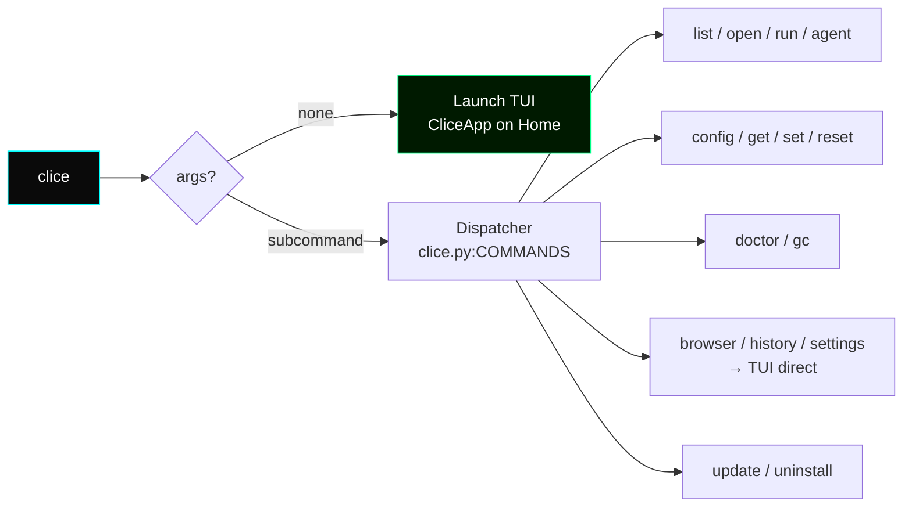

# **Clice CLI Reference**

> Companion to the [User Manual](./Clice-User-Manual.md) and [Technical Documentation](./Clice-Technical-Documentation.md). This file is the **complete, example-driven** reference for _every_ `clice` command, flag, exit code, and edge case.

---

### Table of Contents

1. [Overview & Conventions](#1-overview--conventions)
2. [Quick Reference Table](#2-quick-reference-table)
3. [Challenge ID Resolution](#3-challenge-id-resolution)
4. [Commands](#4-commands)
   - [4.1 `clice` (no args)](#41-clice-no-args)
   - [4.2 `clice list`](#42-clice-list)
   - [4.3 `clice open <id>`](#43-clice-open-id)
   - [4.4 `clice run <id> [mode]`](#44-clice-run-id-mode)
   - [4.5 `clice agent <id>`](#45-clice-agent-id)
   - [4.6 `clice browser` / `history` / `settings`](#46-clice-browser--history--settings)
   - [4.7 `clice config`](#47-clice-config)
   - [4.8 `clice get <key>`](#48-clice-get-key)
   - [4.9 `clice set <key> <value>`](#49-clice-set-key-value)
   - [4.10 `clice reset [key|all]`](#410-clice-reset-keyall)
   - [4.11 `clice doctor`](#411-clice-doctor)
   - [4.12 `clice gc`](#412-clice-gc)
   - [4.13 `clice update`](#413-clice-update)
   - [4.14 `clice uninstall`](#414-clice-uninstall)
   - [4.15 `clice --help` / `clice <cmd> --help`](#415-clice---help--clice-cmd---help)
5. [Configuration Keys — Complete Reference](#5-configuration-keys--complete-reference)
6. [Exit Codes](#6-exit-codes)
7. [Environment Variables](#7-environment-variables)
8. [Common Workflows & Recipes](#8-common-workflows--recipes)
9. [Troubleshooting — CLI Diagnostics](#9-troubleshooting--cli-diagnostics)

---

### 1. Overview & Conventions



- **Notation in this doc:**
  - `<id>` — challenge identifier (see §3). Always `code`, full UUID, or UUID prefix ≥8 chars.
  - `<key>` / `<value>` — dotted setting key and its typed value (see §5).
  - `[brackets]` — optional argument.
  - `$` — your host shell prompt; `[CLICE] root@…:/workspace$` — the _in-container_ prompt.

- **Lazy imports:** `list`, `config`, `get`, `set`, `reset`, `doctor`, `gc`, and `--help` never import `docker` or `pexpect`. They work even if Docker is stopped. Only `run`, `open`, `agent`, and the TUI touch containers.

- **Config layering** (from `ui/services/config.py`): `.env` defaults → `~/.clice/settings.json` overrides → live `Config` instance. Every `set`/`get`/`reset`/`config` talks to the same file.

---

### 2. Quick Reference Table

| Command                   | One-line summary                      | Needs Docker?                             | Writes history?                  |
| :------------------------ | :------------------------------------ | :---------------------------------------- | :------------------------------- |
| `clice`                   | Launch full TUI on Home               | no (Home does health check, but launches) | no                               |
| `clice list`              | Print challenges table                | no (only registry fetch)                  | no                               |
| `clice open <id>`         | TUI straight into a challenge session | **yes** (pull + container)                | on submit                        |
| `clice run <id> [mode]`   | Headless shell loop in your terminal  | **yes**                                   | on submit                        |
| `clice agent <id>`        | JSON-lines agent harness              | **yes**                                   | on submit                        |
| `clice browser`           | TUI straight into Browser             | no                                        | no                               |
| `clice history`           | TUI straight into History             | no                                        | no                               |
| `clice settings`          | TUI straight into Settings REPL       | no                                        | no                               |
| `clice config`            | Print all settings (masked)           | no                                        | no                               |
| `clice get <key>`         | Print one setting (unmasked)          | no                                        | no                               |
| `clice set <key> <value>` | Change and persist a setting          | no                                        | no                               |
| `clice reset [key\|all]`  | Delete override(s) → default          | no                                        | no                               |
| `clice doctor`            | Full system health check              | checks it                                 | no                               |
| `clice gc`                | Reap orphaned `clice-*` containers    | **yes**                                   | no                               |
| `clice update`            | Re-run `install.sh` (fetch latest)    | prompts                                   | no                               |
| `clice uninstall`         | Remove binary + `~/.clice`            | no                                        | deletes if not `--keep-settings` |

---

---

### 3. Challenge ID Resolution

Implemented once in `clice.py:resolve_challenge()` and shared by `open`, `run`, and `agent` — they **never disagree**.

```python
for c in challenges:
    if c["code"] == user_input:          return c  # 1. exact short code
    if c["id"]   == user_input:          return c  # 2. exact UUID
    if len(user_input) >= 8 and c["id"].startswith(user_input):
                                         return c  # 3. UUID prefix (≥8)
```

**Examples:**

```bash
clice run hello-clice                            # 1. short code (most ergonomic)
clice run 550e8400-e29b-41d4-a716-446655440000    # 2. full UUID
clice run 550e8400                               # 3. prefix (8 chars, unambiguous enough)
clice open file-perms                            # same — works in `open` too
clice agent hello-clice --max-commands 20        # and in `agent`
```

If no match, you get:

```
Challenge 'typo-code' not found

Available challenges:
  hello-clice - Hello Clice (beginner)
  file-perms - Permission Puzzle (intermediate)
  ...
```

> **Tip:** `clice list` is the canonical way to discover valid `<id>` values. Its `code` column is what the TUI sidebar and History show too.

---

### 4. Commands

#### 4.1 `clice` (no args)

- **Synopsis:** `clice`
- **Description:** Launch the interactive Textual TUI on the **Home** screen. Equivalent to running the binary with no subcommand — `clice.py:main()` branches to `run_tui()` when `args.command is None`.
- **Examples:**
  ```bash
  clice
  # → Home: System Health, Recent Activity, left nav rail
  # Keys: x (home)  b (browser)  h (history)  s (settings)  q (quit)  Esc (back)
  ```
- **Notes:**
  - `termmax.go_fullscreen()` is attempted on mount; if terminal <100×30, a warning is shown.
  - `clice doctor` logic is _also_ surfaced in Home's health panel (but `doctor` is richer — group membership hint, cache writability).

#### 4.2 `clice list`

- **Synopsis:** `clice list`
- **Description:** Fetch and print all available challenges from the registry. Uses `RegistryService.get_challenges()` (hash-checked cache — instant after first fetch). **Does not** pull any Docker image.
- **Output:**

  ```bash
  $ clice list

  Available challenges:
    hello-clice - Hello Clice (beginner)
    file-perms - Permission Puzzle (intermediate)
    net-scan - Network Recon (advanced)
    proc-hunt - Process Hunter (advanced)
  ```

  Format is `"<code> - <title> (<difficulty>)"`. If a challenge lacks `code`, the first 8 chars of `id` are shown.

- **Exit codes:** `0` always (even if registry is unreachable — prints `[FAIL]` and still returns 0; check `doctor` for diagnostics).
- **Examples:**
  ```bash
  clice list | grep beginner          # filter locally
  clice list | head -n 5
  ```

#### 4.3 `clice open <id>`

- **Synopsis:** `clice open <challenge>`
- **Args:** `challenge` — `<id>` (see [3](#3-challenge-id-resolution))
- **Description:** Launch the TUI **directly into a challenge session**, skipping Home/Browser. Implemented as `run_tui(initial_challenge=challenge_info)`. Shows a `LoadingScreen("Loading <title>...")` while `ChallengeLoader.load_challenge()` runs on a worker thread. On failure, replaces Loading with Home and `notify("Failed to start…")`.
- **Behavior:**
  1. Resolves `<id>` via registry.
  2. Pulls image (first time) with `docker_timeout` cap.
  3. Creates container `clice-{code}-{run_id}` with `mem_limit`, `nano_cpus`, `network_disabled`.
  4. Pushes `SessionScreen(challenge, container, loader)`.
- **Examples:**
  ```bash
  clice open hello-clice
  clice open 550e8400                 # prefix
  # inside the session: type commands, then press the Submit binding (shown in footer)
  # verdict → PASS/FAIL/ENVIRONMENT ERROR
  ```
- **Exit codes:** `0`; startup failures are surfaced as TUI notifications, not process exit codes (since the TUI is still running).
- **Related:** `clice run <id>` — same challenge, but headless (no TUI).

#### 4.4 `clice run <id> [mode]`

- **Synopsis:** `clice run <challenge> [mode]`
- **Args:**
  - `challenge` — `<id>`
  - `mode` — optional, `container` (default) or `raw`. `raw` skips Docker entirely and falls back to `docker run --rm -it -u root ubuntu:22.04 /bin/bash` — useful only for testing `ShellSession` without a challenge image. **Always omit `mode` in normal use.**
- **Description:** The headless counterpart to `open`. Prints the challenge title/description, pulls/starts the container (same `ChallengeLoader`), spawns `ShellSession`, then enters a tight `input(prompt)` loop using the _live_ prompt captured from inside the container.
- **Interaction:**
  - Prompt is dynamic: after `cd /tmp`, you'll see `[CLICE] root@<hash>:/tmp$`.
  - Type any shell command → output is printed immediately (no exit-code annotation — `session.commands` tracks that internally for scoring).
  - `:submit` — break loop, run `verify`, `evaluate`, save to `HistoryService`, print `RESULTS`, `cleanup`, exit.
  - `:quit` — cancel without verifying, `cleanup`, exit `0`.
  - `Ctrl+C` / `Ctrl+D` (EOF) at the prompt → prints `Interrupted - cleaning up...`, `cleanup`, exit `130`.
  - `Ctrl+C` _during_ image pull (before container exists) → `Interrupted before the environment finished starting up.`, exit `130`, nothing to clean.
  - Blocked commands (`nano|vim|vi|crontab|top|htop|less|more`) → prints `[BLOCKED] … not allowed`, exit `1` is recorded, loop continues.
- **Full transcript:**

  ```bash
  $ clice run hello-clice

  == Hello Clice ==
  Create /workspace/hello.txt containing "hello clice"

  Pulling ghcr.io/.../hello-clice:latest...
    Pulling fs layer...
    Downloading...
  ✓ Environment ready

  Type commands. Type ':submit' when done.

  root@a1b2:/workspace$ ls
  root@a1b2:/workspace$ echo "hello clice" > hello.txt
  root@a1b2:/workspace$ cat hello.txt
  hello clice
  root@a1b2:/workspace$ :submit

  Verifying...

  ==================================================
  RESULTS
  ==================================================
  Challenge: ✓ PASSED
  Commands: 3
  Time: 18.2s
  Error rate: 0%
  Log saved: /home/you/.clice/sessions/4f8a9c2e.json

  $ echo $?
  0
  ```

Failure path:

```

Challenge: ✗ FAILED
Commands: 2
Time: 9.1s
Error rate: 50%
Log saved: /home/you/.clice/sessions/...
$ echo $?
1

```

Environment error path:

```

Challenge: ⚠ ENVIRONMENT ERROR - Checker timed out after 1s
$ echo $?
1

```

- **Exit codes:**
- `0` — `PASS` or intentional `:quit`
- `1` — `FAIL` or `ENVIRONMENT ERROR` (and challenge not found)
- `130` — interrupted (`KeyboardInterrupt`/`EOFError`)
- **Examples:**

```bash
clice run hello-clice                   # normal
clice run hello-clice raw              # no challenge container (debug only)
clice run file-perms < /tmp/cmds.txt   # piped stdin is NOT supported — loop uses input(), EOF exits 130
```

- **Notes:**
  - `clice run` always creates a fresh `Config()` — no TUI-stale-config issue (unlike `clice open` if the TUI was already running when you `clice set`).

#### 4.5 `clice agent <id>`

- **Synopsis:** `clice agent <challenge> [--max-commands N]`
- **Args/Options:**
  - `challenge` — `<id>`
  - `--max-commands N` — integer, default `100`. Force-`submit` after N commands (prevents runaway agents).
- **Description:** Machine-facing twin of `run`. Uses the **exact same** `ChallengeLoader`, `ShellSession`, `verify()`, `evaluate()` pipeline — only the UI differs. Protocol is **JSON Lines** over stdin/stdout. Stdout is _only_ JSON (human progress prints from loader are redirected to stderr via `_quiet_stdout()`).
- **Protocol:**
  - **In** (one JSON object per line on stdin):
    ```json
    {"command": "ls -la"}
    {"command": "cat /workspace/hello.txt"}
    {"submit": true}
    ```
  - **Out** (one JSON object per line on stdout):
    ```json
    {"type": "ready", "prompt": "root@a1b2:/workspace$", "challenge": {"code":"hello-clice","title":"...","description":"...","objectives":[...]}}
    {"type": "observation", "stdout": "hello clice\n", "exit_code": 0, "elapsed": 0.042, "prompt": "root@a1b2:/workspace$"}
    {"type": "error", "message": "max_commands (100) exceeded - submitting current state"}
    {"type": "result", "passed": true, "checker_exit_code": 0, "checker_output": "...", "checker_error": null, "metrics": {"correctness":1.0,"command_count":3,"time_seconds":12.1,"error_rate":0.0,"goal_reached":true}, "log_path": "/home/you/.clice/sessions/....json"}
    ```
  - Errors from malformed JSON emit `{"type":"error","message":"Invalid JSON: ..."}` and continue; missing `command`/`submit` keys emit `{"type":"error","message":"Expected a 'command' or 'submit' key"}`.
  - EOF or `KeyboardInterrupt` on stdin emits `{"type":"error","message":"Interrupted before submit"}` and cleans up (exit `130`).
- **Examples:**

  ```bash
  # Minimal agent session (shell)
  clice agent hello-clice <<'JSON'
  {"command": "echo 'hello clice' > hello.txt"}
  {"submit": true}
  JSON

  # With a Python driver
  python3 -u driver.py | clice agent hello-clice --max-commands 50
  ```

  `driver.py` skeleton:

  ```python
  import json, sys
  # clice already printed the "ready" line; read it first
  ready = json.loads(sys.stdin.readline()) if False else None # actually stdout of clice
  # pseudocode: write JSON to clice's stdin, read JSON from its stdout
  ```

  Real usage: spawn `clice agent` as a subprocess, write to its stdin line-by-line, read its stdout line-by-line.

- **Exit codes:** same as `run` — `0` pass, `1` fail/error, `130` interrupted.
- **Notes:**
  - `max_commands` is counted server-side (`command_count`). On exceed, clice emits an `error` line and auto-submits (does not wait for `{"submit":true}`).
  - History is still written — `clice history` shows agent runs too.

#### 4.6 `clice browser` / `history` / `settings`

- **Synopsis:** `clice browser` | `clice history` | `clice settings`
- **Description:** Shorthand launchers that skip Home and push the named screen directly. Mechanically `run_tui(initial_screen="browser"|"history"|"settings")`. No args, no output — they drop you into the TUI.
- **Examples:**
  ```bash
  clice browser    # → Challenge Browser (same as launching `clice` then pressing `b`)
  clice history    # → History (same as `h`)
  clice settings   # → Settings REPL (same as `s`)
  ```
- **Tip:** Combine with shell aliases if you live in one screen.

#### 4.7 `clice config`

- **Synopsis:** `clice config`
- **Description:** Print **every** current setting and its resolved value on one table, plus a human description. API key is **masked** (`***abcd`). Reads live `Config` plus `~/.clice/settings.json` overlay.
- **Output:**
  ```
  KEY                        VALUE                DESCRIPTION
  --------------------------------------------------------------------------------
  resources.memory           512m                 Max memory allocation (e.g. 512m, 1g)
  resources.cpu_cores        1.0                  CPU cores allocated per challenge
  resources.checker_timeout  20                   Checker script timeout (seconds)
  resources.docker_timeout   30                   Docker container startup timeout (seconds)
  behaviour.network          ENABLED              Allow network access inside challenges
  behaviour.auto_cleanup     ENABLED              Auto-remove containers after a session
  ai.model                   deepseek/deepseek-chat-v3-0324:free AI model used for verdict feedback
  ai.api_key                 (not set)            OpenRouter API key (masked - use `get` to reveal)
  ai.max_tokens              800                  Max length of AI feedback responses
  ```
- **Examples:**
  ```bash
  clice config
  clice config | grep ai
  ```

#### 4.8 `clice get <key>`

- **Synopsis:** `clice get <key>`
- **Args:** `key` — one of the 9 dotted keys (case-insensitive).
- **Description:** Print a **single** setting's value **unmasked** (the only command that does). Useful when you need to confirm the exact OpenRouter key or toggle state.
- **Examples:**

  ```bash
  clice get ai.api_key
  # ai.api_key = sk-or-v1-abc...xyz

  clice get behaviour.network
  # behaviour.network = true

  clice get resources.memory
  # resources.memory = 1g
  ```

- **Errors:**
  ```
  Unknown setting 'bad.key'. Run `clice config` to see valid keys.
  # exit 1
  ```

#### 4.9 `clice set <key> <value>`

- **Synopsis:** `clice set <key> <value>`
- **Args:** `key` (case-insensitive), `value` (raw string — typed and validated by `cast_and_validate()`).
- **Description:** Cast, validate, and persist one setting to `~/.clice/settings.json` (never touches `.env`). Updates the live `Config` instance in the same process too, so the next `clice get` sees it immediately. **If the TUI is already running** in another process, that process's `Config` is stale — quit and re-launch the TUI.
- **Validation rules** (`ui/services/settings_schema.py:cast_and_validate`):

  | Key                         | Type   | Valid                                                       | Invalid → error message                        |
  | :-------------------------- | :----- | :---------------------------------------------------------- | :--------------------------------------------- |
  | `resources.memory`          | string | `^\d+[mMgG]$` e.g. `512m`, `1g`, `256M`                     | `expected a format like 512m or 1g`            |
  | `resources.cpu_cores`       | float  | `>0`, e.g. `0.5`, `1.0`, `2`                                | `must be greater than 0` / `expected a number` |
  | `resources.checker_timeout` | int    | `>0`                                                        | `must be greater than 0 seconds`               |
  | `resources.docker_timeout`  | int    | `>0`                                                        | `must be greater than 0 seconds`               |
  | `behaviour.network`         | bool   | `on/off`, `true/false`, `yes/no`, `1/0`, `enabled/disabled` | `expected on/off, true/false, or yes/no`       |
  | `behaviour.auto_cleanup`    | bool   | same as above                                               | same                                           |
  | `ai.model`                  | string | non-empty slug                                              | `value can't be empty`                         |
  | `ai.api_key`                | string | non-empty                                                   | `value can't be empty`                         |
  | `ai.max_tokens`             | int    | `50–4000` inclusive                                         | `must be between 50 and 4000`                  |

- **Examples:**

  ```bash
  clice set resources.memory 1g
  # Saved resources.memory = 1g

  clice set resources.cpu_cores 2.0
  clice set resources.checker_timeout 0      # allowed! forces ENVIRONMENT ERROR for demo
  clice set behaviour.network off            # or: no, false, 0, disabled
  clice set behaviour.auto_cleanup on
  clice set ai.api_key sk-or-v1-abc...xyz
  clice set ai.model deepseek/deepseek-chat-v3-0324:free
  clice set ai.max_tokens 1200

  # errors:
  clice set resources.memory 512
  # Invalid value for 'resources.memory': expected a format like 512m or 1g

  clice set ai.max_tokens 9999
  # Invalid value for 'ai.max_tokens': must be between 50 and 4000

  clice set bogus.key value
  # Unknown setting 'bogus.key'. Run `clice config` to see valid keys.
  ```

- **Persistence:** creates `~/.clice/settings.json` with pretty `json.dumps(indent=2)`:
  ```json
  {
    "challenge_mem_limit": "1g",
    "network_enabled": false
  }
  ```
  Only changed keys are stored (layered over `.env`).

#### 4.10 `clice reset [key|all]`

- **Synopsis:** `clice reset [key]` | `clice reset` | `clice reset all`
- **Args:** `key` — optional single dotted key; omitted, `all`, or `ALL` → reset **everything**.
- **Description:** Delete the override(s) from `~/.clice/settings.json` and re-derive the live instance from `.env`. Equivalent to manually editing `settings.json` and deleting the key, but atomic and validated.
- **Examples:**

  ```bash
  clice set resources.memory 1g
  clice get resources.memory
  # resources.memory = 1g

  clice reset resources.memory
  # Reset resources.memory to default.
  clice get resources.memory
  # resources.memory = 512m     ← from .env/.env.example

  clice set ai.max_tokens 1200
  clice set behaviour.network off
  clice reset                  # no arg → all
  # All settings reset to defaults.
  clice reset all              # same

  clice reset bogus.key
  # Unknown setting 'bogus.key'. Run `clice config` to see valid keys.
  ```

- **Notes:**
  - If `~/.clice/settings.json` doesn't exist, `reset` is a no-op (still prints success).
  - `reset` re-calls `Config.__init__()` internally — so `_env_defaults` snapshot is refreshed too (what the TUI `DEFAULT` column shows).

#### 4.11 `clice doctor`

- **Synopsis:** `clice doctor`
- **Description:** Comprehensive health audit. Exits `0` only if **all** checks pass; `1` otherwise. Intended as the first thing to run when anything is wrong.
- **Checks (in order, as in `clice.py:cmd_doctor`):**
  1.  **Python** — skipped when `sys.frozen == True` (frozen binary bundles its own). Otherwise requires `>=3.10`.
      ```
      [OK] Python 3.11.8 (meets minimum)
      [FAIL] Python 3.9.2 (>= 3.10 required)
      ```
  2.  **Internet** — `HEAD https://raw.githubusercontent.com` with 5s timeout. Isolated so Docker/registry failures aren't misread as "offline".
      ```
      [OK] Internet connection reachable
      [FAIL] No internet connection detected: ...
      ```
  3.  **Docker** — `Utilities().get_docker_status(force=True)` → `client.ping()` + `version()`. If `DockerException` contains `permission|denied|socket`, message is `NOT CONNECTED (check docker group membership)`. If `which docker` exists but ping fails → `NOT CONNECTED (Docker daemon not running)`. If no `docker` binary → `NOT INSTALLED`. When `doctor` sees a non-OK status and `which docker` succeeds but `os.getgroups()` lacks the `docker` gid, it appends:
      ```
      (user not in 'docker' group - run 'sudo usermod -aG docker $USER' and log out/in)
      ```
      Output:
      ```
      [OK] Docker: CONNECTED
      [FAIL] Docker: NOT CONNECTED (Docker daemon not running)
      [FAIL] Docker: NOT INSTALLED
      [FAIL] Docker: NOT CONNECTED (check docker group membership) (user not in 'docker' group ...)
      ```
  4.  **Registry** — `RegistryService(config).get_challenges()` + `is_synced()`.
      ```
      [OK] Registry reachable - 22 challenge(s), in sync
      [OK] Registry reachable - 22 challenge(s), local cache differs from remote
      [FAIL] Registry unreachable: ...
      ```
  5.  **Cache directory** — `config.cache_dir.mkdir(parents=True, exist_ok=True)` + write/delete `".doctor_write_test"`.
      `    [OK] Cache directory writable (/home/you/.clice/cache)
[FAIL] Cache directory not writable (/home/you/.clice/cache): ...`
      Final line:

  ```
  Everything looks good.
  One or more checks failed - see above.
  ```

- **Examples:**
  ```bash
  clice doctor
  clice doctor; echo $?      # 0 = healthy, 1 = at least one FAIL
  ```
- **Related:** Home screen's health panel shows a subset of this (Docker only, cached 15s). `doctor` is authoritative.

#### 4.12 `clice gc`

- **Synopsis:** `clice gc`
- **Description:** Garbage-collect **orphaned** containers left behind by a crash, `kill -9`, or power loss. Uses `docker.containers.list(all=True, filters={"label":"clice.managed=true"})` and removes every container whose `status != "running"` (running orphans are left alone — they might be a concurrent live session).
- **Examples:**

  ```bash
  docker ps -a | grep clice
  # clice-hello-clice-a1b2c3  Exited ...

  clice gc
  # Removed 1 orphaned container(s).

  clice gc
  # Removed 0 orphaned container(s).

  # if Docker unreachable:
  clice gc
  # Cannot reach Docker: ...
  # exit 1
  ```

- **Exit codes:** `0` (even if `0` removed), `1` if `ChallengeLoader(config)` itself fails (Docker down).

#### 4.13 `clice update`

- **Synopsis:** `clice update [--with-docker] [--no-docker]`
- **Options:**
  - `--with-docker` — if Docker is missing on Linux, install it non-interactively.
  - `--no-docker` — never install Docker, skip prompt. Mutually exclusive; last flag wins conceptually but both `if` branches are checked independently.
- **Description:** Self-update. Fetches the _live_ `install.sh` from `https://raw.githubusercontent.com/programming-sai/clice/main/install.sh` via `requests.get(timeout=15)`, writes to a temp file (`tempfile.NamedTemporaryFile(delete=False)`), runs `bash <tmp> [flags]` with live streaming (so color/prompts work), restores `LD_LIBRARY_PATH_ORIG` for frozen builds (PyInstaller-poisoned `LD_LIBRARY_PATH` would break `curl`). This guarantees `clice update` and a manual `curl | bash` can never diverge — they run the **same single source of truth**.
- **Examples:**

  ```bash
  clice update
  # Fetching the latest install script...
  # ==> Detected: linux/x86_64 -> clice-linux-x86_64
  # ...

  clice update --with-docker
  clice update --no-docker
  ```

- **Exit codes:** whatever `bash install.sh` exits with (`0` on success). If fetch fails: prints `Failed to fetch https://...: ...` and exits `1`.
- **Notes:**
  - When not frozen (`pip install -e .`), prints a preamble:
    ```
    Note: this is a source install (pip install -e .) - 'update' only
    affects the separately-installed release binary in ~/.clice/app,
    not this dev environment. Use 'git pull' to update your source checkout.
    ```
  - When frozen and update succeeds, prints:
    ```
    Update complete. Since this replaces the binary on disk (not the
    copy already running), the new version takes effect the next time
    you run clice - not this current invocation.
    ```

#### 4.14 `clice uninstall`

- **Synopsis:** `clice uninstall [--keep-settings] [-y|--yes]`
- **Options:**
  - `--keep-settings` — delete only the binary/symlink, keep `~/.clice/settings.json` + `~/.clice/sessions` + cache.
  - `-y` / `--yes` — skip the interactive `Continue? [y/N]` prompt.
- **Description:** Self-uninstall. Without flags, calls `uninstall.sh` which removes `~/.local/bin/clice`, `~/.clice/app`, and `~/.clice` (settings + history + cache). With `--keep-settings`, it preserves `~/.clice/*` and only removes the binary. **Never touches Docker itself**, even if `install.sh` installed it — that's called out explicitly in both scripts.
- **Examples:**

  ```bash
  clice uninstall
  # This will remove clice and its local data. Continue? [y/N] y
  # ==> Removed /home/you/.local/bin/clice
  # ==> Removed /home/you/.clice/app (the binary + bundled runtime)
  # ==> Removed /home/you/.clice (settings, session history, local registry cache)
  # clice has been uninstalled.

  clice uninstall --keep-settings -y
  # (no prompt, keeps history)
  # ==> Removed /home/you/.local/bin/clice
  # ==> Removed /home/you/.clice/app
  # Keeping ~/.clice/settings.json and ~/.clice/cache (--keep-settings) ...

  # also works piped:
  curl -fsSL https://raw.githubusercontent.com/Programming-Sai/clice/main/uninstall.sh | bash -s -- --keep-settings
  ```

- **Exit codes:** `0` (cancelled at prompt still returns `0`), whatever `bash uninstall.sh` returns on success/failure, `1` on fetch error.
- **Notes:**
  - Equivalent to the manual recipe in `README.md`:
    ```bash
    rm -rf ~/.clice ~/.local/bin/clice
    ```

#### 4.15 `clice --help` / `clice <cmd> --help`

- **Description:** Standard `argparse` help. `clice --help` lists every subcommand and its one-line description. `clice run --help` shows that subcommand's args. No custom handler — parent parser does it.
- **Examples:**

  ```bash
  clice --help
  clice run --help
  # usage: clice run [-h] challenge [mode]

  clice agent --help
  # usage: clice agent [-h] [--max-commands MAX_COMMANDS] challenge

  clice update --help
  clice uninstall --help
  ```

---

### 5. Configuration Keys — Complete Reference

Canonical vocabulary is `ui/services/settings_schema.py:FIELDS` — the _only_ place dotted names, `Config` attrs, and descriptions are declared together. `Config._SCHEMA` is the type side.

| Dotted key                  | `Config` attr           | Env var                     | Type    | Default                               | Allowed values / validation                                                                                                            | Read site                                                                     |
| :-------------------------- | :---------------------- | :-------------------------- | :------ | :------------------------------------ | :------------------------------------------------------------------------------------------------------------------------------------- | :---------------------------------------------------------------------------- |
| `resources.memory`          | `challenge_mem_limit`   | `CLICE_CHALLENGE_MEM_LIMIT` | `str`   | `512m`                                | Regex `^\d+[mMgG]$`. e.g. `32m`, `512m`, `1g`, `2G`                                                                                    | `ChallengeLoader: mem_limit=`                                                 |
| `resources.cpu_cores`       | `challenge_cpu_cores`   | `CLICE_CHALLENGE_CPU_CORES` | `float` | `1.0`                                 | `>0`. e.g. `0.5`, `1`, `2.0` → internally `nano_cpus = int(cores * 1e9)`                                                               | `ChallengeLoader: nano_cpus=`                                                 |
| `resources.checker_timeout` | `checker_timeout`       | `CLICE_CHECKER_TIMEOUT`     | `int`   | `20`                                  | `>0` (seconds). `0` is **rejected** by CLI validation but technically would `join(0)` instantly; use `1` for near-instant timeout demo | `ChallengeLoader.verify(): join(timeout=)`                                    |
| `resources.docker_timeout`  | `docker_timeout`        | `CLICE_DOCKER_TIMEOUT`      | `int`   | `30`                                  | `>0` (seconds)                                                                                                                         | `ChallengeLoader._pull_with_timeout(): join(timeout=)`                        |
| `behaviour.network`         | `network_enabled`       | `CLICE_NETWORK_ENABLED`     | `bool`  | `on` (`true`)                         | `true/false`, `yes/no`, `on/off`, `1/0`, `enabled/disabled`, `ENABLED/DISABLED` (case-insensitive)                                     | `ChallengeLoader: network_disabled=not ...`                                   |
| `behaviour.auto_cleanup`    | `auto_cleanup`          | `CLICE_AUTO_CLEANUP`        | `bool`  | `on`                                  | same bool set                                                                                                                          | `ChallengeLoader.cleanup()` guard; if `off`, containers persist after Verdict |
| `ai.model`                  | `openrouter_model`      | `OPENROUTER_MODEL`          | `str`   | `deepseek/deepseek-chat-v3-0324:free` | non-empty slug; validated at API call time (404 → `model not found` message)                                                           | `AIFeedbackService`                                                           |
| `ai.api_key`                | `openrouter_api_key`    | `OPENROUTER_API_KEY`        | `str`   | `""` (not set)                        | non-empty when setting; displayed **masked** via `display_value()` (`***abcd`)                                                         | `AIFeedbackService` `Authorization: Bearer`                                   |
| `ai.max_tokens`             | `openrouter_max_tokens` | `OPENROUTER_MAX_TOKENS`     | `int`   | `800`                                 | `50–4000` inclusive                                                                                                                    | `AIFeedbackService` `payload["max_tokens"]`                                   |

**Display vs stored:**

```bash
clice set ai.api_key sk-or-v1-abc123...wxyz
clice config                 #→  ***wxyz
clice get ai.api_key         #→  sk-or-v1-abc123...wxyz   (full)
```

**Precedence:**

```
.env / .env.example  ──► Config.__init__ ──► _env_defaults snapshot
                                      │
~/.clice/settings.json ──► _apply_settings_file() ──► live attrs
```

`reset` deletes from `settings.json`; a bare `Config()` with no `settings.json` equals `.env`. Deleting `~/.clice/settings.json` by hand has the same effect as `clice reset`.

**In-TUI parity:** The Settings screen's mini-REPL (`set`/`get`/`reset`/`undo`/`help`) calls the _same_ `cast_and_validate()` + `Config.save()` → `~/.clice/settings.json`. A CLI `set` is visible in TUI after relaunch, and vice versa.

---

### 6. Exit Codes

| Code  | Meaning                                                                                                                          | Produced by                                                                                                                                                      |
| :---- | :------------------------------------------------------------------------------------------------------------------------------- | :--------------------------------------------------------------------------------------------------------------------------------------------------------------- |
| `0`   | Success, or intentional cancel (`run`'s `:quit`, `uninstall` declined)                                                           | `PASS` in `run`/`agent`, `list`, `config`, `get`, `set`, `reset`, `doctor` (all OK), `gc` (even 0 removed), `update`/`uninstall` success, TUI                    |
| `1`   | Generic failure: challenge not found, `FAIL` or `ENVIRONMENT ERROR`, bad arg, validation error, fetch error, `doctor` had a FAIL | `run`/`agent` on fail/error, `set`/`get`/`reset` on unknown key/value, `update`/`uninstall` fetch fail, `doctor` with any `[FAIL]`, `gc` when Docker unreachable |
| `130` | Interrupted by `Ctrl+C` / `EOF` before completion (conventional `128 + SIGINT(2)`)                                               | `run`/`agent` when `KeyboardInterrupt`/`EOFError`                                                                                                                |

> `run` and `agent` **always** exit `0` on `PASS` and `1` on `FAIL` — so CI can gate on `if clice run hello-clice; then ...`. The verbose `RESULTS` block is for humans; the exit code is for scripts.

---

### 7. Environment Variables

All `Config._SCHEMA` keys have an env-var counterpart, read via `os.getenv` at import. They are the source for the "factory default" before `settings.json` overlays.

| Env var                     | Default                                                                                     | Mirrors key                       |
| :-------------------------- | :------------------------------------------------------------------------------------------ | :-------------------------------- |
| `CLICE_CHALLENGE_MEM_LIMIT` | `512m`                                                                                      | `resources.memory`                |
| `CLICE_CHALLENGE_CPU_CORES` | `1.0`                                                                                       | `resources.cpu_cores`             |
| `CLICE_CHECKER_TIMEOUT`     | `20`                                                                                        | `resources.checker_timeout`       |
| `CLICE_DOCKER_TIMEOUT`      | `30`                                                                                        | `resources.docker_timeout`        |
| `CLICE_NETWORK_ENABLED`     | `true`                                                                                      | `behaviour.network`               |
| `CLICE_AUTO_CLEANUP`        | `true`                                                                                      | `behaviour.auto_cleanup`          |
| `OPENROUTER_API_KEY`        | `""`                                                                                        | `ai.api_key`                      |
| `OPENROUTER_MODEL`          | `deepseek/deepseek-chat-v3-0324:free`                                                       | `ai.model`                        |
| `OPENROUTER_MAX_TOKENS`     | `800`                                                                                       | `ai.max_tokens`                   |
| `CLICE_REGISTRY_URL`        | `https://raw.githubusercontent.com/programming-sai/clice-challenges/registry/registry.json` | (registry location)               |
| `CLICE_REGISTRY_HASH_URL`   | `…/registry.hash`                                                                           | (registry hash)                   |
| `CLICE_CACHE_DIR`           | `~/.clice/cache`                                                                            | (`Path(os.path.expanduser(...))`) |
| `CLICE_LOGS_DIR`            | `~/.clice/runs` (or `./assets` fallback)                                                    | (trace logs)                      |
| `CLICE_DEBUG`               | `0` / unset                                                                                 | if `0`, `trace()` is no-op        |

Setting an env var is _roughly_ equivalent to `clice set`, but `set` is preferred because it persists in `settings.json` and survives reboots/shell changes. Env vars are mainly for CI/dockerized runs.

---

### 8. Common Workflows & Recipes

**First day:**

```bash
curl -fsSL https://raw.githubusercontent.com/Programming-Sai/clice/main/install.sh | bash
# new terminal or source ~/.bashrc
clice doctor
clice list
clice open hello-clice      # TUI: do the task, submit
clice history               # review
```

**Learn CLI without TUI:**

```bash
clice run hello-clice
```

**Configure AI coaching:**

```bash
clice set ai.api_key sk-or-v1-...
clice set ai.model deepseek/deepseek-chat-v3-0324:free
clice set ai.max_tokens 1200
clice get ai.api_key        # double-check (unmasked)
clice run hello-clice       # next submit will show AI panel
```

**Resource-constrained or slow network:**

```bash
clice set resources.memory 256m
clice set resources.docker_timeout 60
clice config
clice run hello-clice
clice reset resources.docker_timeout
```

**Offline / network-isolated practice:**

```bash
clice set behaviour.network off
clice run hello-clice       # container has no egress
clice reset behaviour.network
```

**Keep containers for forensics:**

```bash
clice set behaviour.auto_cleanup off
clice run hello-clice       # after verdict, container stays
docker exec -it clice-hello-clice-xxxx bash   # poke around
docker rm -f clice-hello-clice-xxxx           # manual clean
clice set behaviour.auto_cleanup on
# or: clice gc
```

**Demo TRIGGER → ENVIRONMENT ERROR (amber):**

```bash
# checker_timeout is >0 validated, so use 1 + a slow challenge,
# or for any challenge on a fast checker, use the smallest allowed:
clice set resources.checker_timeout 1
clice run net-scan          # slow checker → times out → ENVIRONMENT ERROR
clice reset resources.checker_timeout

# guaranteed for docs (before validation tightened to >0, 0 was the demo trick):
# after: hello-clice checker is ~40ms, so 1s still passes — pick a harder challenge
```

**Agent harness debugging:**

```bash
# watch the protocol line by line
clice agent hello-clice --max-commands 10 <<'JSON' | python3 -m json.tool
{"command": "pwd"}
{"command": "ls -la"}
{"submit": true}
JSON
```

**Reset everything:**

```bash
clice reset                 # or: clice reset all
clice config                # back to defaults
# or manually:
rm ~/.clice/settings.json
```

**Update / remove:**

```bash
clice update
clice update --with-docker
clice uninstall             # prompts
clice uninstall --keep-settings -y
rm -rf ~/.clice ~/.local/bin/clice   # manual equivalent without --keep-settings
```

---

### 9. Troubleshooting — CLI Diagnostics

| Symptom                                                              | Likely cause                                | Fix (CLI)                                                                                                                                |
| :------------------------------------------------------------------- | :------------------------------------------ | :--------------------------------------------------------------------------------------------------------------------------------------- |
| `clice: command not found` right after install                       | `~/.local/bin` not on `PATH` for this shell | `source ~/.bashrc` or new terminal; `echo $PATH` should contain `$HOME/.local/bin`                                                       |
| `clice doctor` → `Docker: NOT CONNECTED (Docker daemon not running)` | daemon down                                 | `sudo systemctl start docker` (Linux) or launch Docker Desktop (macOS)                                                                   |
| `… (check docker group membership)`                                  | user not in `docker` group                  | `sudo usermod -aG docker $USER` + `newgrp docker` or log out/in                                                                          |
| `… NOT INSTALLED`                                                    | Docker not present                          | `install.sh --with-docker` or https://docs.docker.com/engine/install                                                                     |
| `clice set` says `Saved` but `clice config` shows old value          | stale TUI `Config` in another process       | quit and re-launch TUI; `clice get` in a fresh shell is authoritative                                                                    |
| `clice set resources.memory 512` → `expected a format like 512m`     | missing unit                                | `clice set resources.memory 512m`                                                                                                        |
| `clice set ai.max_tokens 10` → `must be between 50 and 4000`         | out of range                                | `clice set ai.max_tokens 800`                                                                                                            |
| `checker_timeout=1` still shows `FAIL` not `ENVIRONMENT ERROR`       | `hello-clice` checker <1s                   | use a slower challenge (`net-scan`, `proc-hunt`) or keep `1` with those; `hello-clice` will always pass/fail before 1s                   |
| `Failed to fetch …/install.sh` from `update`                         | offline/proxy                               | check `clice doctor` Internet line; retry with `--no-docker`/`--with-docker` to skip interactive Docker prompt that needs `/dev/tty`     |
| Orphan `clice-*` containers after crash                              | `KeyboardInterrupt` before `cleanup`        | `clice gc` or `docker rm -f $(docker ps -aq --filter label=clice.managed=true)`                                                          |
| `clice agent` prints no JSON                                         | human prints went to stdout (older bug)     | update: `_quiet_stdout()` now re-routes loader prints to stderr; if still broken, check you're reading stdout line-by-line as JSON Lines |

When filing a bug, include:

```bash
clice doctor
clice config
cat ~/.clice/sessions/*.json | head -n 100
cat ~/.clice/logs/*.log 2>/dev/null | tail -n 80
```

---

<p align='center'>
<em>Clice CLI — every flag, every failure mode, every example.</em><br>
<sub>CLI spec version 0.1.0 · clice.py:build_parser() is the source of truth · Last updated September 2026</sub>
</p>
