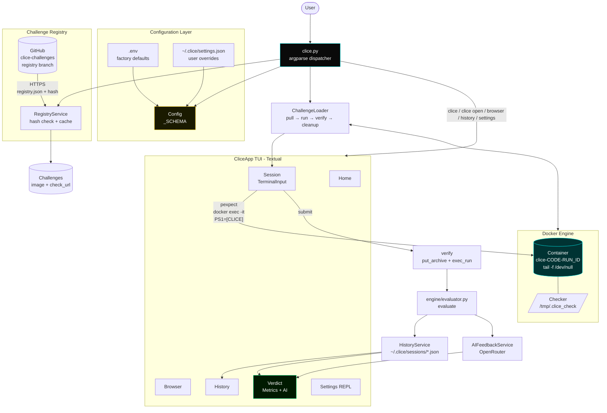
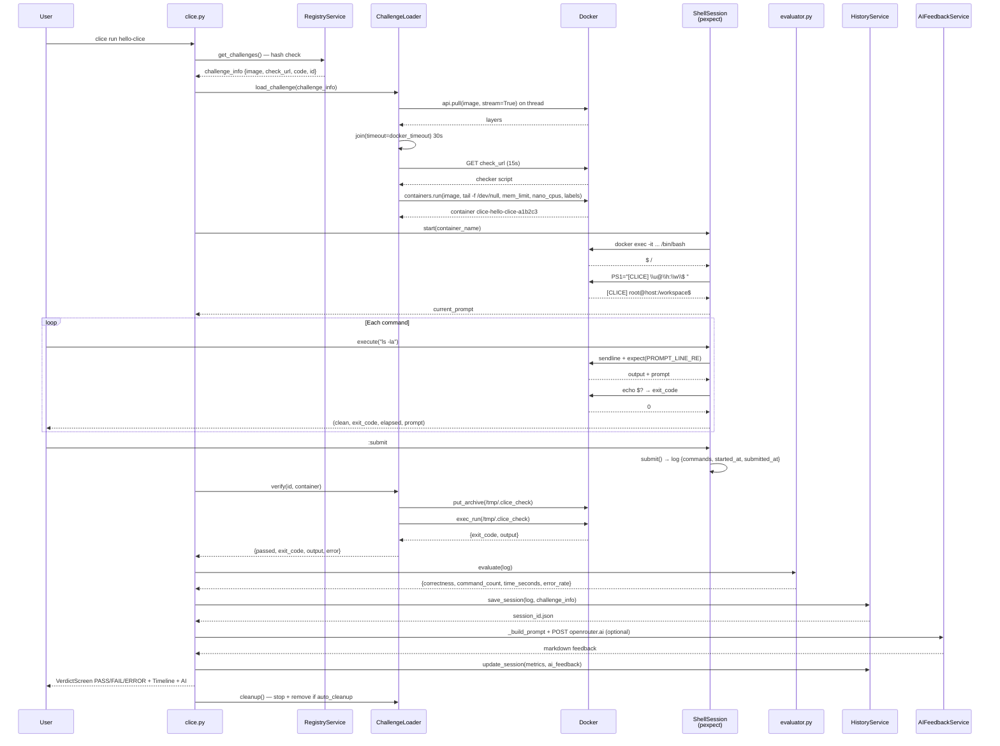
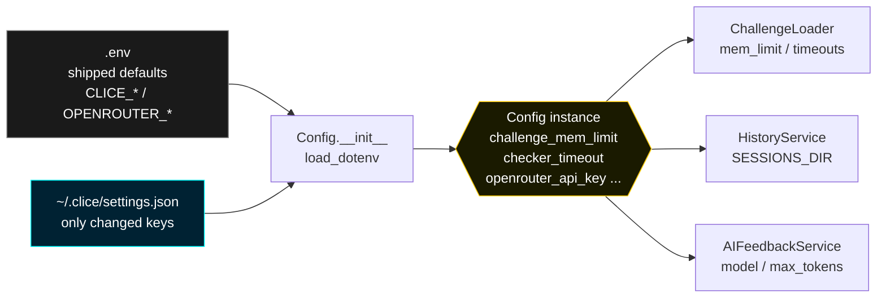

# **Clice Technical Documentation**

---

### Table of Contents

1. [Introduction](#1-introduction)
2. [Installation](#2-installation)
3. [Major Dependencies](#3-major-dependencies)
4. [Project Structure](#4-project-structure)
5. [Architecture Overview](#5-architecture-overview)
6. [Usage](#6-usage)
7. [Features — Deep Dive](#7-features--deep-dive)
8. [Configuration](#8-configuration)
9. [Documentation](#9-documentation)

---

<br><br>

<p align='center'>
<br>
<b>Clice — CLI Competence Evaluator</b><br>
<em>A sandboxed CLI evaluation platform that measures not just what you solved, but how.</em>
</p>
<br>

### 1. Introduction

**Clice — CLI Competence Evaluator** is a Python-based, sandboxed terminal-challenge platform. Unlike conventional CTF or quiz systems that only check _what_ you solved, Clice measures **how** you solved it: command history, error rate, time-to-completion, and a deterministic checker verdict, optionally augmented by an LLM coach.

Key design goals:

- **Host-safe isolation:** every challenge runs in a disposable Docker container. A `rm -rf /` or `chmod 000` cannot escape.
- **Real shell fidelity:** sessions are driven by `pexpect` attached to `docker exec`, not a mocked shell. Tab-completion, signals, prompts (`PS1`), and exit codes behave identically to a native terminal.
- **Deterministic grading:** each challenge ships with its own checker script (any interpreter — bash/python/node) executed _inside_ the same container that the user modified.
- **Single-binary distribution:** end users install one file via `install.sh`. No `pip`, `venv`, or toolchain required (PyInstaller build via `clice.spec`).
- **Offline-first, AI-optional:** verification and metrics never require an API key. OpenRouter-based AI feedback is a purely additive coaching layer.

This document is the engineering companion to the [User Manual](./Clice-User-Manual.md). It covers dependencies, build, project layout, runtime architecture, verification pipeline, and configuration layers.

> **Target reader:** contributors, reviewers, and advanced users who need to modify, extend, or audit Clice.

---

### 2. Installation

#### 2.1 Quick install (end users — recommended)

```bash
curl -fsSL https://raw.githubusercontent.com/Programming-Sai/clice/main/install.sh | bash
# flags:
#   --with-docker  auto-install Docker on Linux, no prompt
#   --no-docker    never install Docker, no prompt
```

What `install.sh` actually does (600+ lines, idempotent):

1.  **Platform detection:** `uname -s` → `linux`/`macos`; `uname -m` → `x86_64`/`arm64`. Native Windows is rejected (no `pexpect` equivalent) with a WSL hint.
2.  **Docker audit:**
    - `docker info` reachable → OK.
    - CLI present but `docker info` fails → branches on `systemctl is-active docker` vs `docker` group membership. Offers `sudo systemctl enable --now docker` and `sudo usermod -aG docker $USER` interactively (reads from `/dev/tty`, not stdin, because `curl | bash` pipes stdin).
    - No Docker on Linux → offers to run `https://get.docker.com` official script.
    - macOS without Docker → instructs `brew install --cask docker` (GUI, cannot be headlessly installed).
3.  **Display-server probe (Linux):** checks `WAYLAND_DISPLAY` vs `DISPLAY` to decide between `wmctrl`/`xdotool` for `termmax` fullscreen support.
4.  **Binary acquisition:** resolves latest GitHub Release asset `clice-${OS}-${ARCH}` (e.g., `clice-linux-x86_64`), downloads to `~/.clice/app`, symlinks `~/.local/bin/clice`, ensures `~/.local/bin` is on `PATH` (prints `source ~/.bashrc` hint if not).

Re-running `install.sh` or `clice update` (which fetches and re-executes the same script via `clice.py::_fetch_and_run_script`) performs an in-place update. `clice uninstall` fetches `uninstall.sh` which removes `~/.clice` and the symlink.

**Verify:**

```bash
clice doctor
# checks: Python >=3.10 (source installs only), Docker ping, registry fetch, cache dir writable
```

#### 2.2 Source install (contributors)

```bash
git clone https://github.com/Programming-Sai/clice.git
cd clice
python3 -m venv .venv && source .venv/bin/activate
pip install -e .          # reads pyproject.toml, installs textual/docker/pexpect/requests/python-dotenv + termmax git dep
# optional dev tools
pip install -e ".[dev]"   # textual-dev
python clice.py doctor
python clice.py list
python clice.py run hello-clice
```

> The frozen binary bundles its own interpreter; `doctor` omits the Python check when `sys.frozen == True`. Source installs surface the check because system Python _is_ the runtime.

#### 2.3 Building the binary locally

```bash
pip install pyinstaller
pyinstaller clice.spec --noconfirm
# output: dist/clice  (single file, includes ui/*.tcss via datas in clice.spec)
# clice.spec explicitly strips the `upx` flag that previously broke termmax's X11 backend
```

---

### 3. Major Dependencies

| Package                | Version                                              | Role in Clice                                                                                                                                                                                                                                                     |
| :--------------------- | :--------------------------------------------------- | :---------------------------------------------------------------------------------------------------------------------------------------------------------------------------------------------------------------------------------------------------------------- |
| **Python**             | `>=3.10`                                             | Baseline. `datetime.fromisoformat` for metrics; no 3.11-only syntax to keep 3.10 compatibility.                                                                                                                                                                   |
| **textual**            | `>=8.0`                                              | Full-screen TUI framework. App is `ui/main.py:CliceApp(App)` with 6 screens (`home`, `browser`, `session`, `verdict`, `history`, `settings`).                                                                                                                     |
| **rich**               | `>=13.0`                                             | Markdown rendering in `DetailPanel`, `VerdictMarkdown`, and `Browser` description pane.                                                                                                                                                                           |
| **docker** (docker-py) | `>=7.0`                                              | Container lifecycle: `docker.from_env()`, `containers.run()`, `api.pull(stream=True)`, `exec_run()`, `put_archive()` for checkers.                                                                                                                                |
| **pexpect**            | `>=4.9`                                              | Real PTY shell. `ShellSession` (`logger/session.py`) spawns `docker exec -it <container> /bin/bash`, sets `PS1="[CLICE] \\u@\\h:\\w\\$ "`, captures prompt via `PROMPT_LINE_RE` after every command. No Windows support — reason for Linux/macOS/WSL requirement. |
| **requests**           | `>=2.31`                                             | Registry fetch (`registry.json` + `registry.hash`), checker script download (`check_url`), OpenRouter API calls for AI feedback.                                                                                                                                  |
| **python-dotenv**      | `>=1.0`                                              | Loads `.env` → `Config._SCHEMA` defaults.                                                                                                                                                                                                                         |
| **termmax**            | `git+https://github.com/Programming-Sai/termmax.git` | Auto-maximize terminal on `CliceApp.on_mount()` via `termmax.go_fullscreen()`. Handles X11 (`wmctrl`/`xdotool`) and Wayland compositors; fallback warns if terminal < 100×30.                                                                                     |
| **setuptools**         | `>=68`                                               | Build backend for `pyproject.toml`.                                                                                                                                                                                                                               |

**System-level:**

- **Docker Engine ≥20.10** — the only runtime prerequisite for end users. Checked via `client.ping()` and `client.version()` in `ui/services/utilites.py:Utilities.get_docker_status()` (cached 15s).
- **bash** inside each challenge image — every image's `tail -f /dev/null` keep-alive expects `/bin/bash`.

---

### 4. Project Structure

Generated via `ftt` (`PS C:\Users\pc\desktop\projects\clice> ftt`):

```
./clice/*
├─ .github/
│       └─ workflows/
│               └─ release.yml
├─ engine/
│       └─ evaluator.py
├─ loader/
│       └─ challenge_loader.py
├─ logger/
│       ├─ debug.py
│       ├─ session.py
│       └─ shell_worker.py
├─ sandbox/
│       ├─ debug_pexpect.py
│       ├─ feedback.py
│       ├─ headless_session_probe.py
│       ├─ pexpect_.py
│       ├─ test_log_writer.py
│       └─ test_pexpect.py
├─ ui/
│       ├─ screens/
│       │       ├─ data/
│       │       │       ├─ challenges.py
│       │       │       ├─ history.py
│       │       │       └─ verdicts.py
│       │       ├─ browser.py
│       │       ├─ browser.tcss
│       │       ├─ history.py
│       │       ├─ history.tcss
│       │       ├─ home.py
│       │       ├─ home.tcss
│       │       ├─ session.py
│       │       ├─ session.tcss
│       │       ├─ settings.py
│       │       ├─ verdict.py
│       │       ├─ verdict.tcss
│       │       └─ __init__.py
│       ├─ services/
│       │       ├─ ai_feedback.py
│       │       ├─ config.py
│       │       ├─ history.py
│       │       ├─ registry.py
│       │       ├─ settings_schema.py
│       │       └─ utilites.py
│       ├─ widgets/
│       │       ├─ challenges/
│       │       │       ├─ challenge_list_item.py
│       │       │       ├─ detail_panel.py
│       │       │       └─ search_input.py
│       │       ├─ history/
│       │       │       ├─ modal.py
│       │       │       ├─ search.py
│       │       │       └─ status.py
│       │       ├─ home/
│       │       │       ├─ about.py
│       │       │       ├─ activity.py
│       │       │       ├─ logo.py
│       │       │       └─ ready.py
│       │       ├─ session/
│       │       │       ├─ app_footer.py
│       │       │       ├─ prompt_config.py
│       │       │       └─ terminal_input.py
│       │       ├─ utils/
│       │       │       └─ design.py
│       │       ├─ verdict/
│       │       │       ├─ eof_marker.py
│       │       │       ├─ metrics_panel.py
│       │       │       ├─ timeline_box.py
│       │       │       ├─ title.py
│       │       │       └─ verdict_markdown.py
│       │       ├─ footer.py
│       │       ├─ loading_overlay.py
│       │       └─ __init__.py
│       ├─ ISSUES.md
│       ├─ main.py
│       └─ __init__.py
├─ .env
├─ .env.example
├─ .fttignore
├─ .gitignore
├─ clice.py
├─ clice.spec
├─ install.sh
├─ pyproject.toml
├─ README.md
├─ requirements.txt
├─ stress_test.sh
└─ uninstall.sh
```

> **Notes for reviewers:** `sandbox/` contains probes/harnesses not shipped in the PyInstaller binary (`clice.spec` bundles only `ui/**/*.tcss`).

---

### 5. Architecture Overview

#### 5.1 High-level system architecture



#### 5.2 Challenge attempt — sequence



#### 5.3 Configuration layering



#### 5.4 Isolation & security model

- **User code never touches host:** all `ShellSession` commands are `docker exec` inside the challenge container. Host filesystem, credentials, and network are not mounted (no volume; workspace is container's own writable layer).
- **Network gating:** `Config.network_enabled` → `network_disabled` at `containers.run` time. When `off`, image pulls still require host network, but the live container cannot egress.
- **Resource caps:** `challenge_mem_limit` (e.g., `512m`, `1g`) and `challenge_nano_cpus` (`cpu_cores * 1e9`) are passed directly to Docker. OOM kills surface as non-zero checker or container `status != running`.
- **Cleanup:** `ChallengeLoader.cleanup()` calls `container.stop()` then `remove()` if `auto_cleanup==True`. `gc()` reaps stopped containers labelled `clice.managed=true`. `ShellSession.terminate()` avoids `execute("exit")` deadlock by using `expect(EOF)` with fallback `terminate(force=True)`.

---

### 6. Usage

#### 6.1 CLI reference

All subcommands are dispatched in `clice.py:main()` via `argparse`. Lazy imports keep `list`/`config`/`doctor` fast — `docker` and `pexpect` are imported only inside `cmd_run`/`cmd_agent`.

| Command                   | Handler                              | Effect                                                                                                                |
| :------------------------ | :----------------------------------- | :-------------------------------------------------------------------------------------------------------------------- |
| `clice`                   | `run_tui()`                          | `CliceApp()` on Home                                                                                                  |
| `clice list`              | `cmd_list`                           | `RegistryService.get_challenges()` → stdout table                                                                     |
| `clice open <id>`         | `cmd_open`                           | `run_tui(initial_challenge=challenge_info)` → LoadingScreen → SessionScreen                                           |
| `clice run <id>`          | `cmd_run`                            | Headless loop: `input(prompt)` → `session.execute()` → `:submit`/`:quit` → verify → metrics → history                 |
| `clice agent <id>`        | `cmd_agent`                          | JSON-lines agent protocol (stdin `{command}`/`{submit:true}` → stdout `{type:ready/observation/result/error}`)        |
| `clice browser`           | `run_tui(initial_screen="browser")`  | Direct to Browser                                                                                                     |
| `clice history`           | `run_tui(initial_screen="history")`  | Direct to History                                                                                                     |
| `clice settings`          | `run_tui(initial_screen="settings")` | Direct to Settings                                                                                                    |
| `clice config`            | `cmd_config`                         | Prints `FIELDS` with `display_value()` (masks `ai.api_key`)                                                           |
| `clice get <key>`         | `cmd_get`                            | Unmasked single value                                                                                                 |
| `clice set <key> <value>` | `cmd_set`                            | `cast_and_validate()` → `Config.save()` → `settings.json`                                                             |
| `clice reset [key\|all]`  | `cmd_reset`                          | Deletes key(s) from `settings.json` → `Config.__init__()` re-derive                                                   |
| `clice doctor`            | `cmd_doctor`                         | Docker ping, group membership (`id -nG`), registry fetch, cache dir                                                   |
| `clice gc`                | `cmd_gc`                             | `ChallengeLoader.gc()`                                                                                                |
| `clice update`            | `cmd_update`                         | Fetches `install.sh` via `requests`, runs via `bash` in temp file (restores `LD_LIBRARY_PATH_ORIG` for frozen builds) |
| `clice uninstall`         | `cmd_uninstall`                      | Fetches `uninstall.sh` similarly                                                                                      |

ID resolution (`resolve_challenge`) is intentionally permissive for ergonomics but deterministic: exact `code` first, then exact UUID, then UUID prefix.

#### 6.2 TUI flow

- **Home** — `ui/screens/home.py` composes `Logo`, `About`, `Activity` (last N sessions from `HistoryService`), `Ready` (calls `Utilities.get_docker_status()`). Global bindings `x/b/h/s/q` push screens; `on_mount` checks `size < 100×30` and warns.
- **Browser** — `ui/screens/browser.py` is the most complex screen: `ListView` of `ChallengeListItem` (difficulty badge, active cyan state) + `DetailPanel` (Rich Markdown, code block highlighting). Search bar debounces and applies `title:`, `category:`, regex `/.../`, and `:pass`/`:fail`. `@work(thread=True)` loads challenges so UI never blocks on registry fetch. `Enter` → `ChallengeLoader.load_challenge()` on worker, then `SessionScreen`.
- **Session** — `ui/screens/session.py` embeds `TerminalInput` (`ui/widgets/session/terminal_input.py`). Unlike a `Static`, this widget manages `self._prompt_len`/`_prompt_pad`, `update_prompt()` (called from `ShellSession.execute` result), arrow/backspace guards that respect dynamic prompt length, and `get_input()` slicing. The footer from `app_footer.py` shows Submit keybinding.
- **Verdict** — `ui/screens/verdict.py` lays out `MetricsPanel`, `Title` (PASS/FAIL/ERROR color), `TimelineBox` (command list with `EofMarker`), and `VerdictMarkdown` (checker output + AI). AI is fetched via `AIFeedbackService` inside `@work(thread=True)`; `r` re-triggers.
- **History** — searchable `DataTable` backed by `HistoryService` reading `~/.clice/sessions/*.json`; filter syntax identical to Browser.
- **Settings** — mini REPL parsing `set/get/reset/undo/help`. `undo` pops an in-memory stack; `reset all` clears `settings.json`. Help panel is inline markdown.

#### 6.3 Non-interactive / headless

```bash
# Plain mode is ideal for SSH, CI, or screen-reader terminals
clice run hello-clice
# Agent mode is for LLM evaluation harnesses:
echo '{"command":"ls"}' | clice agent hello-clice --max-commands 50
# Both produce HistoryService entries so `clice history` stays unified
```

---

### 7. Features — Deep Dive

#### 7.1 Sandboxed shell (logger/session.py)

- **Prompt tracking:** `PS1` is forced to `[CLICE] \u@\h:\w\$ ` so `PROMPT_LINE_RE` never collides with program output that might contain `$` or `#`. `current_prompt` is decoded from `child.match.group(1)` bytes on every `execute`, allowing `cd /tmp` or `PS1="> "` to reflect instantly in the TUI footer.
- **Output hygiene:** `_strip_control_sequences` removes ANSI CSI (`\x1b[...`), `PROMPT_LEAK_RE` removes stray prompt echoes that leak due to PTY buffering, and echo-stripping (`clean.lstrip("\r\n")` + `if clean.startswith(command)`) ensures the user's typed line never pollutes captured output.
- **Exit code fidelity:** a second transaction (`echo $?` → regex `\b\d+\b`) captures the _real_ exit status even when output contains numbers. `commands[].exit_code` is what `error_rate` uses.
- **Time measurement:** `elapsed = time.time() - start` per `execute`; summed indirectly via `started_at`/`submitted_at` in `evaluate`. `max(0.0, diff)` guards against clock skew.

#### 7.2 Challenge loading & verification (loader/challenge_loader.py)

- **Registry decoupling:** challenges live in `programming-sai/clice-challenges` (separate repo + `registry` branch). `RegistryService` GETs `registry.json` and `registry.hash`; if hash unchanged since last cache, `get_challenges()` returns cached file (no redundant download). This is why `clice list` is instant after first run.
- **Checker contract:** each `challenge_info` contains `image` (Docker Hub reference) and `check_url` (raw checker script). The script's shebang determines interpreter; `put_archive` + `chmod +x` + `exec_run([remote_path])` makes language-agnostic execution possible (bash sh, python3, even `node` if image provides it).
- **Timeout semantics:** both `_pull_with_timeout` and `verify` use the same pattern — work on a daemon thread, `join(timeout=config_value)`. If `is_alive()` after join, the operation is considered failed but the daemon thread is _not_ killed (Python threads are non-killable); the container/`put_archive` side-effect is discarded by returning an error dict and, on next `cleanup`, the whole container is removed.
- **Staging errors:** `verify` distinguishes _staging_ failures (no script cached, `put_archive` raises) from _execution_ timeouts from _checker-reported_ failures. Only the last is `FAIL`; the former two are `ENVIRONMENT ERROR`.

#### 7.3 Metrics (engine/evaluator.py)

Pure functions with no I/O (testable in isolation):

```python
correctness   = 1.0 if log["goal_reached"] else 0.0
command_count = len(log["commands"])
time_seconds  = max(0.0, (submitted_at - started_at).total_seconds())
error_rate    = 100 * sum(c["exit_code"] != 0 for c in commands) / len(commands)  (0 if no commands)
```

`evaluate(log)` returns `{correctness, command_count, time_seconds, error_rate, goal_reached}` — this dict is what `HistoryService.update_session` persists and `VerdictScreen` renders.

#### 7.4 AI coach (ui/services/ai_feedback.py)

- **Prompt:** composed in `_build_prompt()` from challenge `title/description/markdown/objectives/difficulty/category` + session `goal_reached/checker_output/checker_error` + formatted first 20 commands (with 150-char output preview). Checker output is truncated to 500 chars to keep tokens bounded.
- **Call:** `POST https://openrouter.ai/api/v1/chat/completions` with `Authorization: Bearer <api_key>`, `max_tokens` (default 800), `temperature 0.3`. Timeout 30s, 3 attempts with `sleep(attempt)` backoff on `ConnectionError/Timeout`; 4xx returns immediately with human-readable message (401 → bad key, 404 → bad model).
- **Rendering:** response is Markdown, streamed into `VerdictMarkdown`. If `finish_reason == "length"`, a truncation notice is appended advising to raise `ai.max_tokens`. `r` in VerdictScreen re-runs the whole call.

#### 7.5 Registry & history services

- **RegistryService:** `get_challenges()` is the single chokepoint every `list/open/run` goes through. Handles corrupt cache, missing `image`/`check_url` (falls back to placeholder), and thread-safe refresh.
- **HistoryService:** `SESSIONS_DIR = ~/.clice/sessions` (created on demand). `save_session` writes `log` (from `ShellSession.submit()`) plus `challenge_info` envelope. `update_session(session_id, metrics, ai_feedback)` is called twice — once immediately after `evaluate`, once after AI resolves (so history degrades gracefully if AI never completes).

#### 7.6 Shell UI details

- `TerminalInput` stores prompt padding per-instance (`self._prompt_len`, `self._prompt_pad`) rather than global constants, because two concurrent sessions could have different prompts.
- `CliceApp`'s `LoadingScreen` exists specifically to avoid flashing Home when `clice open <id>` is used. `on_mount` deliberately _does not_ `push_screen("home")` when `initial_challenge` is set; it pushes `LoadingScreen` then worker-loads. `pop_screen` override ensures popping past Session/Verdict never leaves an empty stack — it pushes Home on demand.

---

### 8. Configuration

#### 8.1 Layering model

Already visualized in 5.3. In code (`ui/services/config.py:Config`):

```
.env  (factory defaults, shipped, never written)
  ↓  load_dotenv() in Config.__init__
~/.clice/settings.json  (user overrides, only changed keys)
  ↓  _apply_settings_file() overlays
Config instance attributes  (what every consumer reads)
```

- **First run:** no `settings.json` → instance equals `.env`.
- **`clice set`:** `Config.save(**{attr:value})` → writes `settings.json` → updates instance in place.
- **`clice reset <key>` / `reset all`:** deletes key(s) from `settings.json` → `self.__init__()` re-derives from `.env` baseline.

Both `.env` expansion (`os.path.expanduser` on `CLICE_CACHE_DIR`/`CLICE_LOGS_DIR`) and boolean coercion (`_to_bool` accepts `1/true/yes/on`) are centralized.

#### 8.2 Schema (config.py:\_SCHEMA + settings_schema.py:FIELDS)

| Key (user-facing)           | Attr                    | Env var                     | Type  | Default                               | Effect where read                           |
| :-------------------------- | :---------------------- | :-------------------------- | :---- | :------------------------------------ | :------------------------------------------ |
| `resources.memory`          | `challenge_mem_limit`   | `CLICE_CHALLENGE_MEM_LIMIT` | str   | `512m`                                | `loader: mem_limit=`                        |
| `resources.cpu_cores`       | `challenge_cpu_cores`   | `CLICE_CHALLENGE_CPU_CORES` | float | `1.0`                                 | `loader: nano_cpus=` (×1e9)                 |
| `resources.checker_timeout` | `checker_timeout`       | `CLICE_CHECKER_TIMEOUT`     | int   | `20`                                  | `loader.verify: join(timeout=)`             |
| `resources.docker_timeout`  | `docker_timeout`        | `CLICE_DOCKER_TIMEOUT`      | int   | `30`                                  | `loader._pull_with_timeout: join(timeout=)` |
| `behaviour.network`         | `network_enabled`       | `CLICE_NETWORK_ENABLED`     | bool  | `true`                                | `loader: network_disabled=not ...`          |
| `behaviour.auto_cleanup`    | `auto_cleanup`          | `CLICE_AUTO_CLEANUP`        | bool  | `true`                                | `loader.cleanup` guard                      |
| `ai.model`                  | `openrouter_model`      | `OPENROUTER_MODEL`          | str   | `deepseek/deepseek-chat-v3-0324:free` | `AIFeedbackService.model`                   |
| `ai.api_key`                | `openrouter_api_key`    | `OPENROUTER_API_KEY`        | str   | `""`                                  | `AIFeedbackService.api_key`                 |
| `ai.max_tokens`             | `openrouter_max_tokens` | `OPENROUTER_MAX_TOKENS`     | int   | `800`                                 | `AIFeedbackService.max_tokens`              |

Validation lives in `settings_schema.py:cast_and_validate(attr, raw)` — e.g., memory must match `^\d+[kmg]?$`, cpu_cores >0.

> [!NOTE]
> `clice config` masks `ai.api_key` as `***abcd`. Use `clice get ai.api_key` to reveal (needed when double-checking OpenRouter keys). The TUI `get` command behaves identically.

**TUI Settings REPL extras:**

- `undo` — pops the settings undo stack (`SettingsScreen` maintains `self._undo_stack`).
- `help` — prints `FIELDS` inline.
- `reset all` alias for `reset` with no args.

#### 8.3 Troubleshooting config from a technical angle

- **Stale TUI after `clice set`:** if you changed settings via CLI while the TUI was already running, that `Config` instance is stale. Quit and re-launch; `clice run` is always fresh (new process).
- **`checker_timeout=1` still shows FAIL not ENVIRONMENT ERROR:** `hello-clice` checker completes in <50ms, so 1s is not a timeout. Use `0` or a slower challenge.
- **Manually trigger any error (for docs/demo):** `clice set resources.checker_timeout 0` → `clice run hello-clice` → `:submit` → guaranteed `ENVIRONMENT ERROR (Checker timed out after 0s)`.
- **`Failed to fetch .../install.sh` from `clice update`:** offline or corporate proxy; pass `--no-docker`/`--with-docker` explicitly if hanging on Docker prompt.

---

### 9. Documentation

Primary docs (all Markdown, versioned in repo root):

- **User Manual** — `Clice-User-Manual.md` / `./User-Manual.md` — task-oriented: how to install, navigate, solve, configure AI, and troubleshoot. Heavily illustrated with `docs/images/*`. This is what `clice doctor` and the `Ready` widget cross-reference.
- **Technical Documentation** — _this file_ — architecture, contracts, and deep internals.
- **Inline code docs** — every public function carries a docstring; `logger/debug.py:trace()` emits JSON-lines to `~/.clice/logs/clice.log` with `challenge_id`, `container_name`, `elapsed`, etc., for post-mortems. `trace` is no-op if `CLICE_DEBUG=0`.

```bash
# generate combined artifact for submission
cat Clice-User-Manual.md > docs_bundle.md
cat Clice-Technical-Documentation.md >> docs_bundle.md
```

---

<p align='center'>
<em>Clice — built with Python, Textual, Docker, and pexpect.</em><br>
<sub>Documentation version 0.1.0 · Last updated September 2026 · <a href="https://github.com/Programming-Sai/clice">github.com/Programming-Sai/clice</a></sub>
</p>
