# **Clice User Manual**

---

### Table of Contents

1. [Introduction](#1-introduction)
2. [Getting Started](#2-getting-started)
3. [Navigation](#3-navigation)
4. [Features](#4-features)
   - [Home Screen — Dashboard](#home-screen--dashboard)
   - [Challenge Browser](#challenge-browser)
   - [Live Challenge Session (TUI)](#live-challenge-session-tui)
   - [Plain CLI Mode](#plain-cli-mode)
   - [History](#history)
   - [Settings & Configuration](#settings--configuration)
   - [AI Coach Feedback](#ai-coach-feedback)
5. [Additional Tips](#5-additional-tips)
6. [Troubleshooting](#6-troubleshooting)

---

<br><br>

<p align='center'>
<br>
<b>Clice — CLI Competence Evaluator</b><br>
<em>A sandboxed CLI evaluation platform that measures not just what you solved, but how.</em>
</p>
<br>

### Overview

Clice is a **sandboxed terminal-challenge platform**. Pull a challenge, work inside an isolated Docker container, get graded automatically, and optionally receive AI feedback on your approach.

Think of it as a self-hosted, terminal-native way to **practice real CLI skills** — from beginner file-manipulation exercises up through advanced process, networking, and system-administration challenges — all run in disposable containers so nothing you do can touch your actual machine.

Clice ships as a **single self-contained binary** with only one external dependency: Docker. It runs on Linux, macOS, and WSL, and provides both a full-screen Textual-based TUI and a plain-text CLI mode for automation and low-resource environments.

### 1. Introduction

Welcome to the Clice user manual! This manual is designed to provide you with everything you need to effectively use Clice. Whether you're browsing challenges, solving tasks inside an isolated sandbox, reviewing your history, tweaking resource limits, or enabling AI-powered feedback, this manual will guide you through every feature.

Clice measures **competence, not just completion** — it tracks your command history, error rate, time taken, and whether your solution passed the hidden checker script. That timeline is saved locally and, if you opt in, sent to an LLM for a personalized written breakdown.

---

### 2. Getting Started

To begin using Clice, follow these steps:

#### System Requirements

- **Linux, macOS, or WSL.** No native Windows support (yet) — Clice uses `pexpect` under the hood for real interactive shell sessions, which requires a Unix-like environment.
- **Docker**, installed and running. This is the _only_ real external dependency.

#### Installation

Run the one-line installer. It detects your platform, checks for Docker (and — on Linux only, if you say yes — offers to install it via Docker's official script), downloads the correct binary, and puts `clice` on your `PATH`:

```bash
curl -fsSL https://raw.githubusercontent.com/Programming-Sai/clice/main/install.sh | bash
```

If this is your first time and `~/.local/bin` wasn't already on your `PATH`, open a new terminal (or run the `source ~/.bashrc` / `source ~/.zshrc` line the installer prints) before `clice` will be found.

#### Verify Your Installation

```bash
clice doctor
```

This checks Docker connectivity, the challenge registry, your local cache directory, and your Python environment (for source installs), and tells you plainly if anything's wrong _before_ you try to run a challenge.

<sup><sub> [Refer To The Technical Documentation For Extensive Explanation on Installation.](./Clice-Technical-Docs.md#2-installation) </sub></sup>

<br>
<p align='center'>
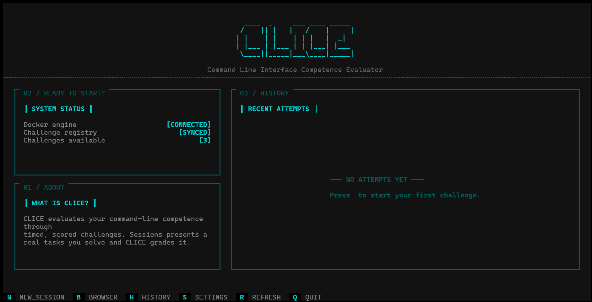<br>
Clice Home Screen — your launchpad.
</p>
<br>

---

### 3. Navigation

Clice can be launched in two ways: the **full interactive TUI** or **direct CLI shortcuts**.

#### Launching the TUI

| Command           | What It Does                                                                  |
| :---------------- | :---------------------------------------------------------------------------- |
| `clice`           | Launch the full interactive TUI on the **Home** screen                        |
| `clice browser`   | Launch straight into the **Challenge Browser**                                |
| `clice history`   | Launch straight into **History**                                              |
| `clice settings`  | Launch straight into **Settings**                                             |
| `clice open <id>` | Launch the TUI **directly into a challenge session**, skipping all navigation |

`<id>` accepts a challenge's short code (`eg. hello-clice`), its full UUID, or an 8+ character prefix of that UUID.

#### Inside the TUI — Global Keybindings

The footer always shows the available shortcuts:

| Key   | Screen                                               |
| :---- | :--------------------------------------------------- |
| `x`   | **Home** — dashboard, system health, recent activity |
| `b`   | **Browser** — searchable list of all challenges      |
| `h`   | **History** — past sessions, searchable              |
| `s`   | **Settings** — live configuration panel              |
| `q`   | **Quit** Clice                                       |
| `Esc` | Go back to the previous screen                       |

> [!NOTE]
> `clice run <id>` **skips the TUI entirely** and runs a challenge in plain-text CLI mode — ideal for scripting, SSH sessions, or minimal terminals. See [Plain CLI Mode](#plain-cli-mode).

<br>
<p align='center'>
<br>
TUI footer with global navigation hints.
</p>
<br>

- You can also jump to any screen directly from the command line without passing through Home — e.g., `clice history` is identical to pressing `h` after launching `clice`.

---

### 4. Features

#### Home Screen — Dashboard

Your landing page after running `clice` with no arguments.

- **System Health Panel** — shows Docker status (Connected / Not Connected / Permission Error), registry status, and cache directory health at a glance.
- **Recent Activity Table** — your last 5–10 sessions with challenge code, PASS/FAIL/ERROR, time taken, and date.
- **Left Navigation Rail** — quick notes for Browser, History, and Settings.
- **Ready Prompt** — confirms Clice is ready and hints at `clice doctor` if anything is unhealthy.

Use `b` to browse challenges or `clice list` from any shell to see what's available without opening the TUI.

<br>
<p align='center'>
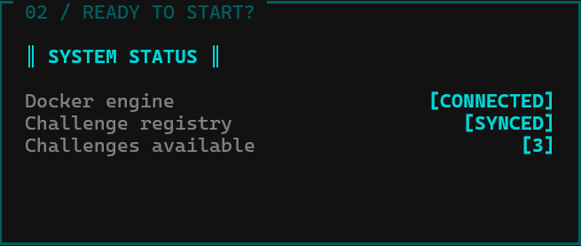
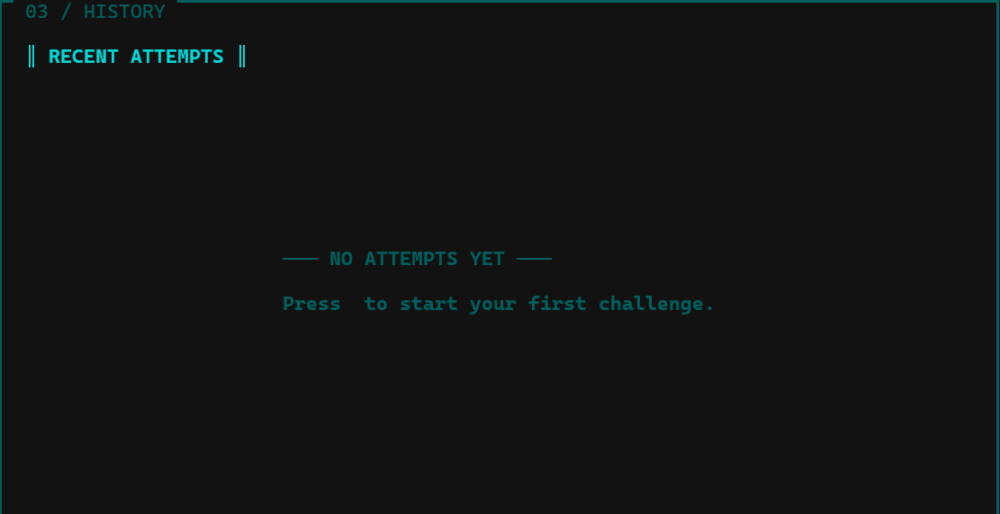

<br>
</p>
<br>

---

#### Challenge Browser

Discover and filter every available challenge.

- **Split-pane layout**: scrollable challenge list on the left, detailed Markdown description on the right with syntax highlighting.
- **Search bar** (`/` to focus): supports:
  - Plain substring — `login`
  - Field-filtered — `title:login`, `category:file`, `difficulty:advanced`
  - Regex — `title:/^failed/`
  - Status shortcuts — `:pass` / `:fail` (when used in History)
- **Live filtering** — results update as you type.
- **Difficulty badges**: <span style="color:green">green = beginner</span>, <span style="color:orange">orange = intermediate</span>, <span style="color:red">red = advanced</span>.
- **Active row highlighting** — cyan background on the selected challenge.
- Press `Enter` on a highlighted challenge to start it immediately.

> [!TIP]
> Challenges are pulled automatically from the [clice-challenges](https://github.com/programming-sai/clice-challenges) registry. You don't need to do anything to get new ones — `clice list` and the Browser always reflect the latest set.

<br>
<p align='center'>
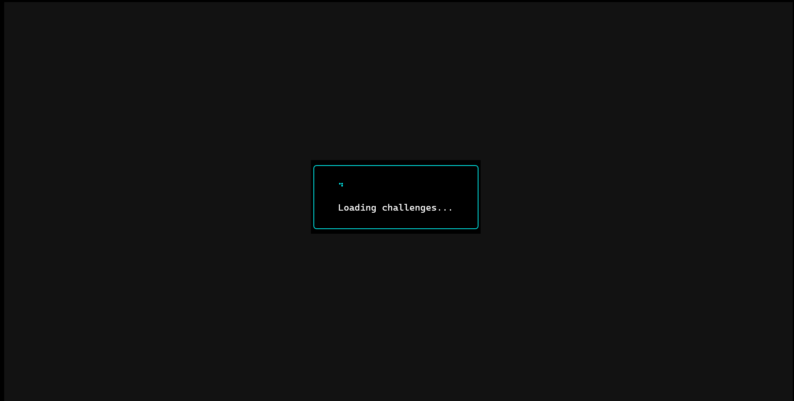
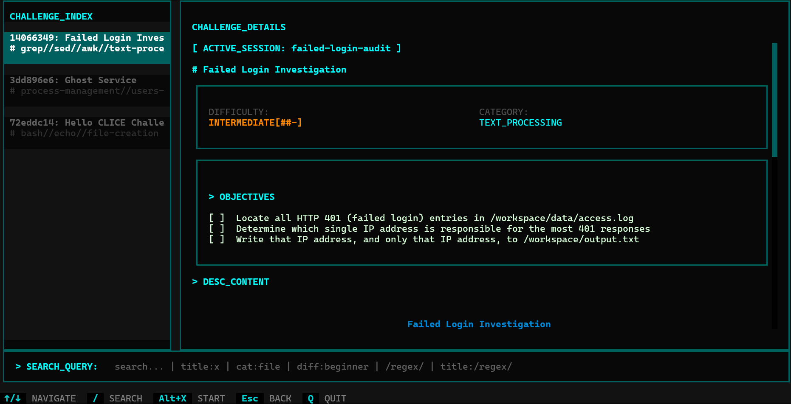
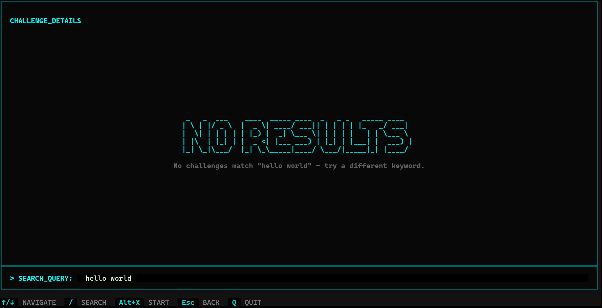
<br>
</p>
<br>

---

#### Live Challenge Session (TUI)

The core experience — a real interactive shell inside a disposable Docker container.

**Starting a session:**

- From Browser: `Alt+X` on a challenge
- From anywhere: `clice open hello-clice`

**What happens:**

1. Clice pulls the challenge's Docker image (only the first time — cached thereafter).
2. A container is created with your configured memory/CPU/network limits.
3. A `pexpect`-backed shell session is spawned with prompt `[CLICE] user@host:/workspace$` — the prompt is **captured live** after every command, so `cd`, `PS1` changes, and user/host are tracked accurately.

**Inside the session:**

- Type Linux commands normally — `ls`, `cat`, `mkdir`, `grep`, `ps`, `chmod`, etc.
- Dynamic prompt display updates after every command.
- Full line editing: arrow keys, backspace/delete, Ctrl+A/Ctrl+E, select-all.
- Sidebar shows **challenge code** and remaining context.

**Submitting:**

- Use `Ctrl+S` or type `:submit` and only `:submit` for CLI mode.
- Clice runs the hidden **checker script** inside the same container to verify your solution.

**Verdict Screen:**
| Color | Meaning |
| :--- | :--- |
| 🟩 **PASS** (green) | Checker exited 0 — you solved it |
| 🟥 **FAIL** (red) | Checker exited non-zero — requirements not met |
| 🟨 **ENVIRONMENT ERROR** (amber) | Checker itself couldn't run — _not_ your fault |

The verdict screen shows:

- **METRICS** — command count, time elapsed, error rate
- **SYSTEM_VERDICT** — PASS/FAIL/ERROR with checker output
- **TIMELINE** — your exact command history with exit codes and durations
- **AI FEEDBACK** (if configured) — streaming Markdown analysis; press `r` to retry if it fails or times out

> [!WARNING]
> The container is **ephemeral**. Unless `behaviour.auto_cleanup` is set to `off`, it is removed automatically after you leave the verdict screen. Any files you created outside `/workspace` or after submission will not persist.

<br>
<p align='center'>

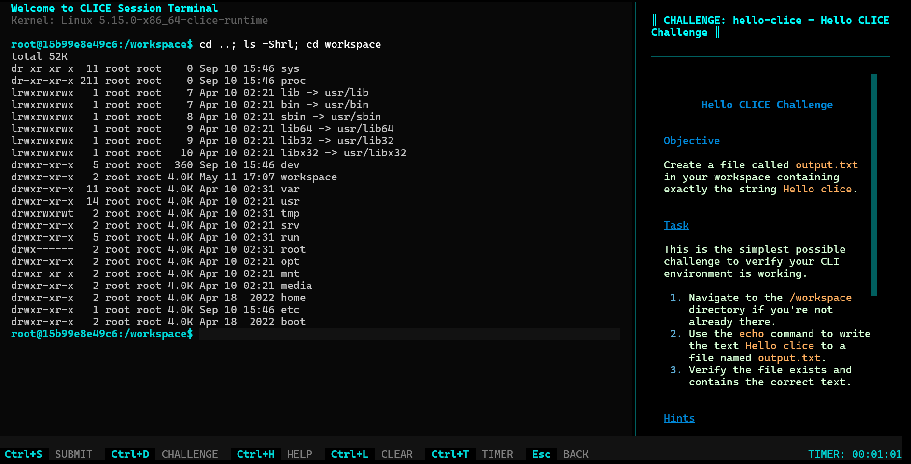<br>
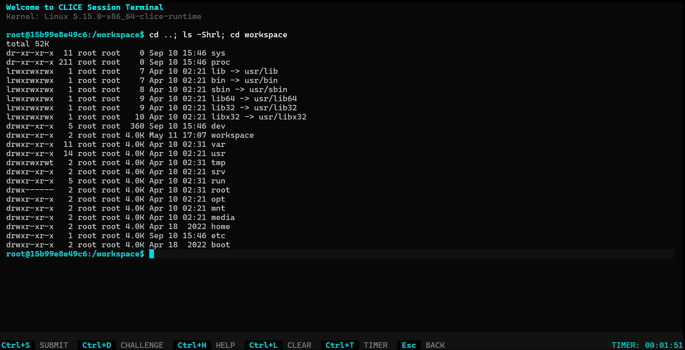<br>
</p>
<br>

---

#### Plain CLI Mode

Run a challenge without any TUI — pure terminal, scriptable, and lightweight.

```bash
clice run hello-clice
# or by UUID
clice run 550e8400-e29b-41d4-a716-446655440000
# or by 8-char prefix
clice run 550e8400
```

Flow:

```
✓ Environment ready

Type commands. Type ':submit' when done.

root@a1b2c3:/workspace$ ls -la
total 12
drwxr-xr-x 2 root root 4096 Sep 10 10:00 .
...

root@a1b2c3:/workspace$ :submit

Verifying...
==================================================
RESULTS
==================================================
Challenge: ✓ PASSED
Commands: 7
Time: 23.4s
Error rate: 14%
Log saved: ~/.clice/sessions/<session_id>.json
```

- `:submit` — submit for verification
- `:quit` — bail out early without verification (container still cleaned up)
- `Ctrl+C` at the prompt — interrupts and cleans up gracefully, no orphaned containers

> [!NOTE]
> `clice run` and `clice open` share the same challenge resolver — short code, full UUID, and prefix always mean the same challenge in both modes.

---

#### History

Review every attempt you've ever made — searchable and filterable.

- Launched via `h` in the TUI or `clice history` from the shell.
- Table columns: Challenge code, title, verdict (PASS/FAIL/ERROR), command count, time, date.
- **Same search syntax as Browser**: `title:login`, `category:network`, `:pass`, `:fail`, regex `/pattern/`.
- Select a row to reopen the full **verdict view** for that session (metrics + timeline + checker output + AI feedback if it was generated).
- Session logs are stored as JSON in `~/.clice/sessions/<session_id>.json`.

<br>
<p align='center'>
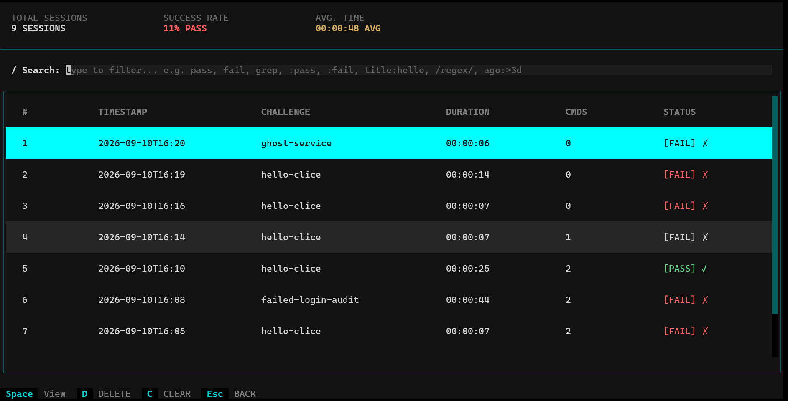<br>
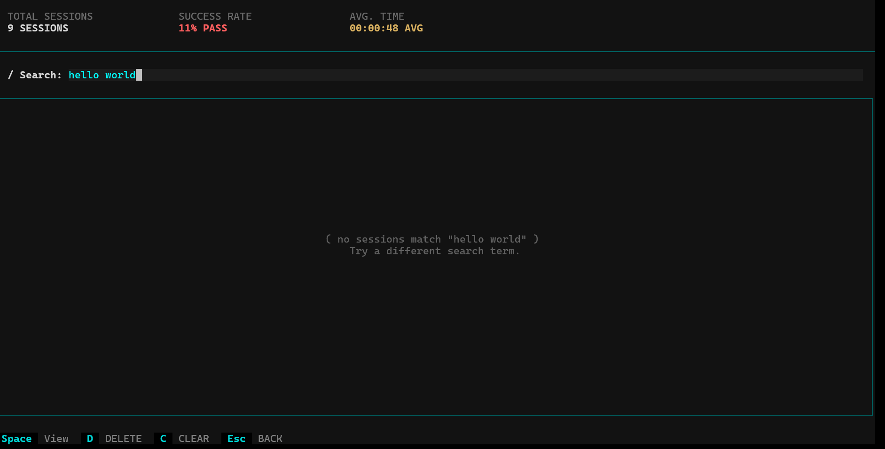<br>
</p>
<br>

---

#### Settings & Configuration

Clice settings are layered: built-in defaults → `~/.clice/settings.json` (only stores what you've changed). Deleting that file or running `clice reset` restores defaults.

**All settings at a glance (`clice config`):**

| Key                         | Default                               | What It Controls                                                             |
| :-------------------------- | :------------------------------------ | :--------------------------------------------------------------------------- |
| `resources.memory`          | `512m`                                | Memory limit for the challenge container (Docker format: `512m`, `1g`, etc.) |
| `resources.cpu_cores`       | `1.0`                                 | CPU cores allocated to the challenge container                               |
| `resources.checker_timeout` | `20`                                  | Seconds before a hung/slow checker script is killed                          |
| `resources.docker_timeout`  | `30`                                  | Seconds before a stalled image pull is given up on                           |
| `behaviour.network`         | `on`                                  | Whether challenge containers get network access                              |
| `behaviour.auto_cleanup`    | `on`                                  | Whether containers are removed automatically after a session                 |
| `ai.model`                  | `deepseek/deepseek-chat-v3-0324:free` | Model used for AI feedback via OpenRouter                                    |
| `ai.api_key`                | _(not set)_                           | Your OpenRouter API key                                                      |
| `ai.max_tokens`             | `800`                                 | Max length of the AI feedback response                                       |

**CLI Settings Commands:**

| Command                           | What It Does                                           |
| :-------------------------------- | :----------------------------------------------------- |
| `clice config`                    | Print every current setting and value (API key masked) |
| `clice get <key>`                 | Print one setting in full (unmasks the API key)        |
| `clice set <key> <value>`         | Change a setting                                       |
| `clice reset <key>`               | Revert one setting to default                          |
| `clice reset` / `clice reset all` | Revert _everything_ to defaults                        |

Example:

```bash
clice set resources.memory 1g
clice set behaviour.network off
clice get ai.api_key
clice reset resources.memory
```

**Inside the TUI Settings Screen** (`s`):
A mini command line with the same keys plus extras:

- `set <key> <value>` — change a setting
- `get <key>` — inspect a value
- `reset <key>` / `reset all` — revert
- `undo` — step back through your last change
- `help` — show available commands

> [!NOTE]
> The TUI Settings screen and the `clice set/get` CLI commands write to the **same** `~/.clice/settings.json` file — changes are instantly visible in both places.

<br>
<p align='center'>
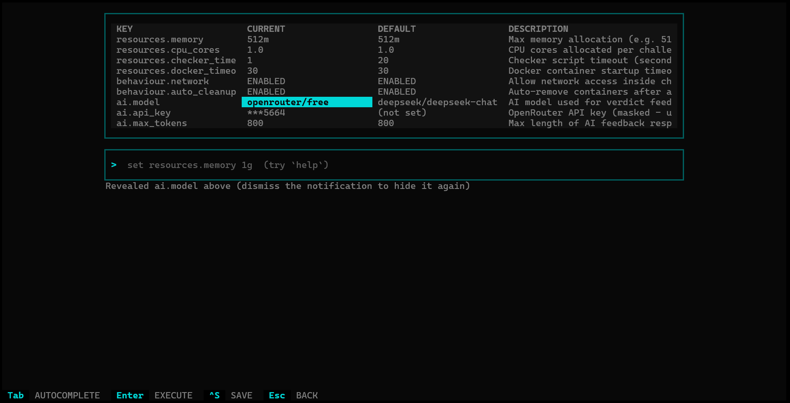<br>
TUI Settings — live configuration with undo and help.
</p>
<br>

---

#### AI Coach Feedback

After you submit, Clice can generate a **written breakdown** of your approach — what you did well, what you missed, why the checker passed or failed — using an LLM. This is **entirely optional**; verification, scoring, and PASS/FAIL are independent and never require an API key.

**Setup (once):**

1. Get an **OpenRouter API key** at [openrouter.ai/keys](https://openrouter.ai/keys) — OpenRouter is an OpenAI-compatible gateway with many free-tier models.
2. Pick a **model slug** — any valid OpenRouter model. The default `deepseek/deepseek-chat-v3-0324:free` is free to try.

```bash
clice set ai.api_key sk-or-...your-key-here
clice set ai.model deepseek/deepseek-chat-v3-0324:free
# optional: control response length
clice set ai.max_tokens 800
```

Confirm:

```bash
clice config            # key shown masked (last few chars)
clice get ai.api_key    # full key, for verification
```

Next submission will stream AI feedback automatically into the verdict screen's **AI FEEDBACK** panel. While loading you'll see `_Loading AI feedback..._` — press `r` to retry if it errors or times out. If no key is set, you'll see a friendly note that feedback isn't available instead of an error.

> [!IMPORTANT]
> AI feedback is a **coaching layer**, not the grader. Your PASS/FAIL verdict comes solely from the deterministic checker script. The AI never overrides it.

<br>
<p align='center'>
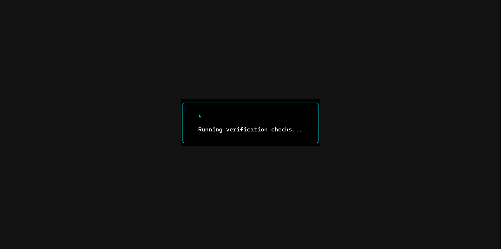<br>
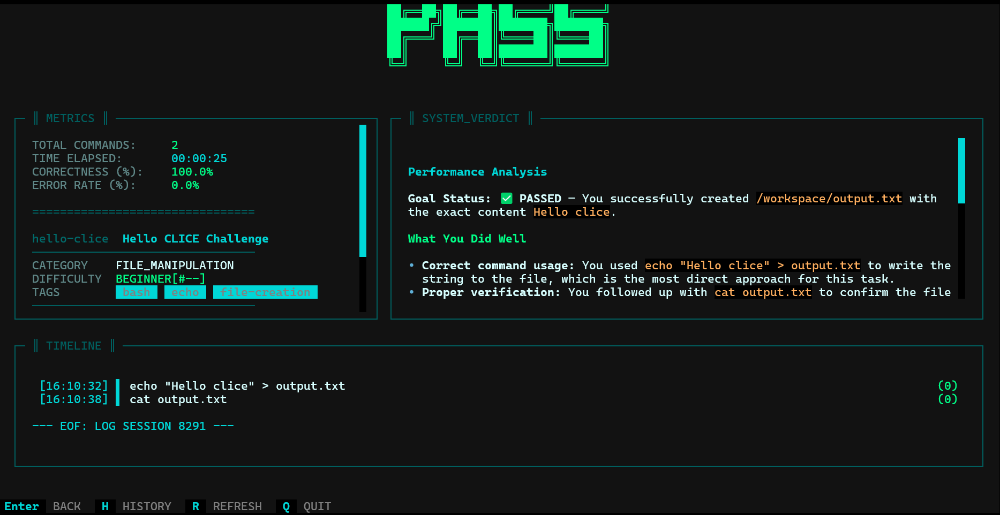<br>
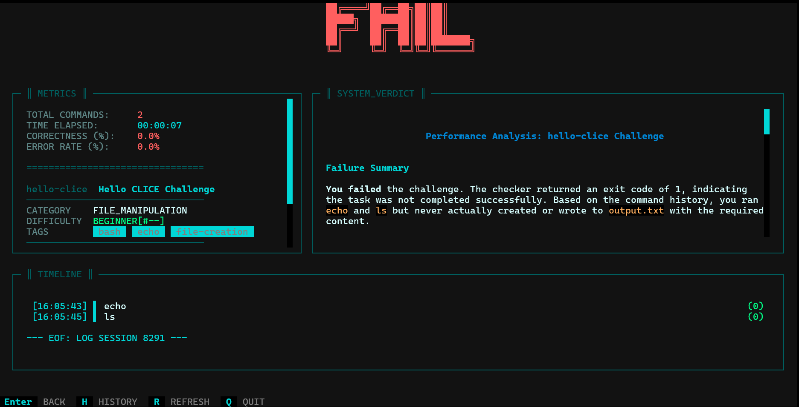<br>
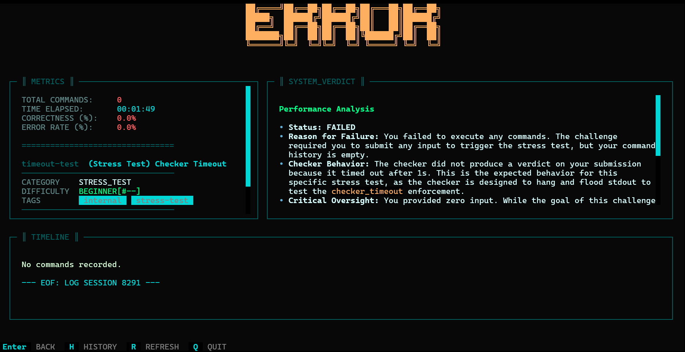<br>
</p>
<br>

---

### 5. Additional Tips

Make the most out of Clice with these handy tips:

- **Explore by difficulty.** Start with `difficulty:beginner` challenges (single-command file tasks) before tackling `advanced` system-administration tasks.
- **Use `clice list` often.** It's the fastest way to see what's new — the registry syncs automatically from the challenges repo.
- **Experiment in the sandbox.** The container is isolated — you cannot break your host machine. Try `rm -rf`, `chmod 000`, or killing processes freely.
- **Leverage search.** Both Browser and History support `title:`, `category:`, `difficulty:` filters and regex — great when you have dozens of challenges.
- **Tune resources for heavy challenges.** Some networking/process challenges benefit from `clice set resources.memory 1g` or `resources.cpu_cores 2.0`.
- **Disable network when practicing offline.** `clice set behaviour.network off` ensures challenges can't reach the internet — useful for focused file-system exercises.
- **Check `clice doctor` first.** It catches 90% of setup issues before you waste time pulling images.
<!-- - **Refer to the Help inside Settings.** Type `help` in the TUI Settings command line for an instant cheat-sheet.

<br>
<p align='center'>
<br>
In-app Help accessible via <code>help</code> in Settings.
</p>
<br> -->

---

### 6. Troubleshooting

Encountering issues? Here's what to do:

- **Check your internet connection.** Challenge image pulls and AI feedback both require internet access.
- **`clice: command not found` right after installing** — Open a **new terminal**, or run the `source ~/.bashrc` (or `source ~/.zshrc`) line the installer printed. A shell script cannot modify the `PATH` of the session that ran it — this is normal shell behavior, not a bug.
- **`clice doctor` shows `Docker: NOT CONNECTED` right after the installer set up Docker** — Run `newgrp docker` or open a new terminal for the group-membership change to take effect. Also expected.
- **`Docker: PERMISSION DENIED`** — Your user isn't in the `docker` group. Run:
  ```bash
  sudo usermod -aG docker $USER
  newgrp docker
  # or log out and back in
  ```
- **`Docker: NOT INSTALLED`** — Install Docker from [docs.docker.com/get-docker](https://docs.docker.com/get-docker) and ensure the daemon is running (`sudo systemctl start docker` on Linux).
- **Everything feels slow the first time you open a challenge** — That's a real Docker image pull (often hundreds of MB). It only happens once per challenge; later runs reuse the cached image and are much faster. Increase `resources.docker_timeout` if you're on a slow connection.
- **AI feedback says "not available" or shows an error** — Either `ai.api_key` isn't set, or OpenRouter rejected the key/model. Run:
  ```bash
  clice get ai.api_key
  clice get ai.model
  clice set ai.api_key <correct-key>
  ```
  Also verify the model slug exists at [openrouter.ai/models](https://openrouter.ai/models).
- **Orphaned containers after a crash (`docker ps` shows `clice-*` containers)** — Run:
  ```bash
  clice gc
  ```
  This removes any crashed/killed session containers.
- **TUI looks broken or text is garbled** — Ensure your terminal is at least 80×24 and supports UTF-8 / 256 colors. Try maximizing the window. The app uses [termmax](https://github.com/Programming-Sai/termmax/) to auto-maximize on launch where supported.
- **Settings not saving** — Check that `~/.clice/settings.json` is writable (`ls -ld ~/.clice`). Run `clice config` to see what Clice actually loaded.
- **And in severe cases, reinstall:**
  ```bash
  clice update          # re-run the official install script
  # or fully remove:
  rm -rf ~/.clice ~/.local/bin/clice
  # then reinstall:
  curl -fsSL https://raw.githubusercontent.com/Programming-Sai/clice/main/install.sh | bash
  ```

> [!WARNING]
> If a challenge session freezes for more than 2 minutes and the container is unresponsive, press `Ctrl+C` twice or close the terminal. Run `clice doctor` and `clice gc` before retrying. If the checker itself hangs, it will be killed after `resources.checker_timeout` seconds (default 20s) and reported as `ENVIRONMENT ERROR`.

> [!NOTE]
> For source installs (`pip install -e .`), `clice update` only updates the release binary in `~/.clice/app`, not your repo checkout — use `git pull` instead.

---

<p align='center'>
<em>Clice — built with Python, Textual, Docker, and pexpect.</em><br>
<sub>Documentation version 0.1.0 · Last updated September 2026 · <a href="https://github.com/Programming-Sai/clice">github.com/Programming-Sai/clice</a></sub>
</p>
